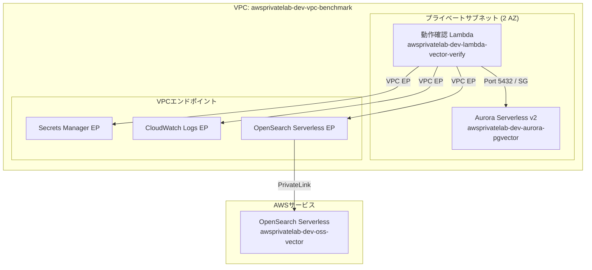
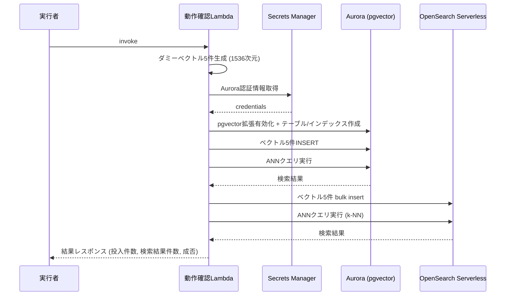

# 技術設計書: ベクトルDB ベンチマーク基盤

## 概要

本設計書は、Aurora Serverless v2 (pgvector) と OpenSearch Serverless (ベクトルエンジン) の2つのベクトルデータベースを AWS CDK v2 (TypeScript) で構築し、Lambda関数 (Python 3.13) による最小限の動作確認を行うシステムの技術設計を定義する。

すべてのリソースはVPC内のプライベートサブネットに配置し、NAT Gatewayを使用せずVPCエンドポイント経由でAWSサービスにアクセスする。環境は `cdk destroy` で完全に削除可能な構成とする。

### 設計方針

- 単一CDKスタック (`AwsPrivateLabStack`) に全リソースを定義
- Construct単位で論理的に分割し、再利用性を確保
- cdk-nagによるセキュリティチェックを全リソースに適用
- removalPolicy: DESTROY を全リソースに設定
- 命名規則: `awsprivatelab-dev-{サービス名}-{用途}`

## アーキテクチャ

### 全体構成



### ネットワーク設計

- VPC CIDR: `10.0.0.0/16`
- プライベートサブネット: 2 AZ に ISOLATED サブネットを配置
- NAT Gateway: 不使用（コスト削減）
- VPCエンドポイント（Interface型）:
  - `com.amazonaws.{region}.secretsmanager` — Aurora認証情報取得
  - `com.amazonaws.{region}.logs` — CloudWatch Logs出力
  - `com.amazonaws.{region}.aoss` — OpenSearch Serverlessアクセス

### セキュリティグループ設計

| セキュリティグループ | インバウンド | アウトバウンド |
|---|---|---|
| Lambda SG | なし | Aurora SG:5432, VPC EP SG:443 |
| Aurora SG | Lambda SG:5432 | なし |
| VPC EP SG | Lambda SG:443 | なし |


## コンポーネントとインターフェース

### CDK Construct 構成

```
AwsPrivateLabStack
├── NetworkConstruct          # VPC、サブネット、VPCエンドポイント、セキュリティグループ
├── AuroraConstruct           # Aurora Serverless v2 クラスター
├── OpenSearchConstruct       # OpenSearch Serverless コレクション + ポリシー
└── VerifyFunctionConstruct   # 動作確認Lambda関数 + IAMロール
```

### 1. NetworkConstruct

VPCネットワーク基盤を構築する。

```typescript
interface NetworkConstructProps {
  // 追加のpropsは不要（デフォルト値で構成）
}

// 公開プロパティ
class NetworkConstruct extends Construct {
  readonly vpc: ec2.Vpc;
  readonly lambdaSg: ec2.SecurityGroup;
  readonly auroraSg: ec2.SecurityGroup;
  readonly vpcEndpointSg: ec2.SecurityGroup;
}
```

- VPC: 2 AZ、ISOLATEDサブネットのみ（NAT Gateway なし）
- セキュリティグループ: Lambda用、Aurora用、VPCエンドポイント用の3つ
- VPCエンドポイント: Secrets Manager、CloudWatch Logs、OpenSearch Serverless

### 2. AuroraConstruct

Aurora Serverless v2 (PostgreSQL + pgvector) クラスターを構築する。

```typescript
interface AuroraConstructProps {
  vpc: ec2.Vpc;
  auroraSg: ec2.SecurityGroup;
}

class AuroraConstruct extends Construct {
  readonly cluster: rds.DatabaseCluster;
  readonly secret: secretsmanager.ISecret; // 自動生成される認証情報
}
```

- エンジン: PostgreSQL 16.x (Aurora Serverless v2)
- ACU: Min 0.5 / Max 16.0
- 認証: Secrets Manager自動生成
- 削除ポリシー: DESTROY、スナップショットスキップ

### 3. OpenSearchConstruct

OpenSearch Serverless ベクトル検索コレクションを構築する。

```typescript
interface OpenSearchConstructProps {
  vpc: ec2.Vpc;
  vpcEndpointSg: ec2.SecurityGroup;
  lambdaRoleArn: string; // データアクセスポリシー用
}

class OpenSearchConstruct extends Construct {
  readonly collection: opensearchserverless.CfnCollection;
  readonly collectionEndpoint: string;
}
```

- コレクションタイプ: VECTORSEARCH
- ポリシー:
  - 暗号化ポリシー: AWS所有キーで暗号化
  - ネットワークポリシー: VPCエンドポイント経由のみ
  - データアクセスポリシー: Lambda IAMロールのみ許可
- OCU制限: CfnAccountSettings でインデックス用・検索用それぞれ Max 4〜8 に制限

### 4. VerifyFunctionConstruct

動作確認用Lambda関数を構築する。

```typescript
interface VerifyFunctionConstructProps {
  vpc: ec2.Vpc;
  lambdaSg: ec2.SecurityGroup;
  auroraCluster: rds.DatabaseCluster;
  auroraSecret: secretsmanager.ISecret;
  opensearchCollectionEndpoint: string;
}

class VerifyFunctionConstruct extends Construct {
  readonly function: lambda.Function;
}
```

- ランタイム: Python 3.13
- メモリ: 256 MB
- タイムアウト: 300秒（DB初期化 + データ投入 + 検索を含む）
- VPC配置: プライベートサブネット
- 環境変数:
  - `AURORA_SECRET_ARN`: Aurora認証情報のSecret ARN
  - `AURORA_CLUSTER_ENDPOINT`: Auroraクラスターエンドポイント
  - `OPENSEARCH_ENDPOINT`: OpenSearchコレクションエンドポイント
  - `POWERTOOLS_SERVICE_NAME`: `vector-verify`
  - `POWERTOOLS_LOG_LEVEL`: `INFO`

### Lambda関数のファイル構成

```
functions/vector-verify/
├── handler.py          # Lambdaエントリポイント
├── logic.py            # ビジネスロジック（ベクトル生成、DB操作）
├── models.py           # データモデル（dataclass）
└── requirements.txt    # 依存ライブラリ
```

### Lambda関数の処理フロー




## データモデル

### Aurora (pgvector) テーブルスキーマ

```sql
CREATE EXTENSION IF NOT EXISTS vector;

CREATE TABLE IF NOT EXISTS embeddings (
    id SERIAL PRIMARY KEY,
    content TEXT NOT NULL,
    embedding vector(1536) NOT NULL,
    created_at TIMESTAMP WITH TIME ZONE DEFAULT NOW()
);

CREATE INDEX IF NOT EXISTS embeddings_hnsw_idx
    ON embeddings USING hnsw (embedding vector_cosine_ops)
    WITH (m = 16, ef_construction = 64);
```

- HNSWインデックス: コサイン類似度ベース
- パラメータ: m=16, ef_construction=64（小規模データ向けデフォルト）

### OpenSearch Serverless インデックスマッピング

```json
{
  "settings": {
    "index": {
      "knn": true,
      "knn.algo_param.ef_search": 100
    }
  },
  "mappings": {
    "properties": {
      "id": { "type": "integer" },
      "content": { "type": "text" },
      "embedding": {
        "type": "knn_vector",
        "dimension": 1536,
        "method": {
          "name": "hnsw",
          "space_type": "cosinesimil",
          "engine": "faiss",
          "parameters": {
            "m": 16,
            "ef_construction": 64
          }
        }
      }
    }
  }
}
```

### Lambda レスポンスモデル

```python
@dataclass
class DatabaseResult:
    """各データベースの動作確認結果"""
    database: str           # "aurora_pgvector" or "opensearch"
    insert_count: int       # 投入件数
    search_result_count: int  # 検索結果件数
    success: bool           # 成否
    error_message: str | None = None

@dataclass
class VerifyResponse:
    """動作確認Lambda全体のレスポンス"""
    aurora: DatabaseResult
    opensearch: DatabaseResult
    vector_dimension: int   # 1536
    total_vectors: int      # 5
```

### ダミーベクトル生成

```python
import random

def generate_dummy_vectors(count: int, dimension: int) -> list[list[float]]:
    """ダミーベクトルを生成する（外部API不使用）"""
    return [
        [random.uniform(-1.0, 1.0) for _ in range(dimension)]
        for _ in range(count)
    ]
```

- 1536次元のランダム浮動小数点数配列
- `random` モジュールのみ使用（Bedrock等の外部API不使用）
- 各要素は -1.0 〜 1.0 の範囲

### draw.io 構成図

`docs/architecture-vector-benchmark.drawio` に以下を含む構成図を作成:

- VPC境界とサブネット配置
- セキュリティグループの境界
- VPCエンドポイントの接続経路
- Aurora クラスターと OpenSearch コレクションの配置
- Lambda関数からの通信経路


## 正当性プロパティ

*プロパティとは、システムのすべての有効な実行において真であるべき特性や振る舞いのことである。人間が読める仕様と機械的に検証可能な正当性保証の橋渡しとなる形式的な記述である。*

### プロパティ 1: リソース命名規則の一貫性

*任意の* CDKスタック内のユーザー定義名を持つリソースに対して、そのリソース名は `awsprivatelab-dev-` で始まるパターンに一致しなければならない。

**検証対象: 要件 1.6**

### プロパティ 2: ダミーベクトル生成の正確性

*任意の* 正の整数 count と正の整数 dimension に対して、`generate_dummy_vectors(count, dimension)` は長さ count のリストを返し、各要素は長さ dimension のリストであり、すべての要素は -1.0 以上 1.0 以下の浮動小数点数でなければならない。

**検証対象: 要件 5.3**

### プロパティ 3: レスポンスモデルの完全性

*任意の* DatabaseResult に対して、`database`、`insert_count`、`search_result_count`、`success` フィールドが存在し、`success` が False の場合は `error_message` が None でない値を持たなければならない。

**検証対象: 要件 5.9**

### プロパティ 4: 全リソースの削除ポリシー

*任意の* 合成されたCloudFormationテンプレート内の DeletionPolicy をサポートするリソースに対して、その DeletionPolicy は "Delete" に設定されていなければならない。

**検証対象: 要件 6.1, 6.3**

## エラーハンドリング

### Lambda関数のエラーハンドリング戦略

| エラー種別 | 対処方法 | レスポンス |
|---|---|---|
| Aurora接続失敗 | Secrets Manager取得 → 接続リトライ（最大3回） | `success: false`, `error_message` に詳細 |
| pgvector拡張有効化失敗 | DDL実行エラーをキャッチ | `success: false`, `error_message` に詳細 |
| OpenSearch接続失敗 | VPCエンドポイント経由の接続リトライ（最大3回） | `success: false`, `error_message` に詳細 |
| データ投入失敗 | トランザクションロールバック（Aurora）/ エラーログ出力 | `success: false`, 投入済み件数を記録 |
| 検索クエリ失敗 | タイムアウト設定 + エラーログ出力 | `success: false`, `error_message` に詳細 |

### CDKスタックのエラーハンドリング

- cdk-nag違反: デプロイ前にエラーとして検出、抑制理由をコメントで明記
- リソース作成失敗: CloudFormationのロールバック機能に依存
- 依存関係エラー: Construct間の明示的な依存関係定義で回避

### Powertools for AWS Lambda の活用

```python
from aws_lambda_powertools import Logger, Tracer

logger = Logger(service="vector-verify")
tracer = Tracer(service="vector-verify")

@logger.inject_lambda_context
@tracer.capture_lambda_handler
def handler(event, context):
    ...
```

- 構造化ログ出力（JSON形式）
- エラー発生時のスタックトレース自動記録
- Lambda コンテキスト情報の自動付与

## テスト戦略

### テストの二重アプローチ

本プロジェクトでは、ユニットテストとプロパティベーステストの両方を実施する。

#### ユニットテスト

特定の具体例、エッジケース、エラー条件を検証する。

**CDKテスト（TypeScript / Jest）:**
- CloudFormationテンプレートのアサーション
- リソースプロパティの検証
- cdk-nagチェックの合格確認

**Pythonテスト（pytest）:**
- Lambda handler のモックテスト
- ビジネスロジックの単体テスト
- データモデルの検証

#### プロパティベーステスト

すべての入力に対して普遍的に成立するプロパティを検証する。

**ライブラリ:** Hypothesis（Python）
- 各プロパティテストは最低100回のイテレーションを実行
- 各テストにはデザインドキュメントのプロパティ番号をタグ付け
- タグ形式: `Feature: 01-vector-db-benchmark, Property {番号}: {プロパティ名}`

### テスト対象と手法の対応

| テスト対象 | 手法 | ツール |
|---|---|---|
| VPCリソース構成 | ユニットテスト（CDK assertions） | Jest |
| NAT Gateway不使用 | ユニットテスト（CDK assertions） | Jest |
| VPCエンドポイント存在 | ユニットテスト（CDK assertions） | Jest |
| Aurora構成（ACU、削除ポリシー） | ユニットテスト（CDK assertions） | Jest |
| OpenSearch構成（ポリシー、OCU） | ユニットテスト（CDK assertions） | Jest |
| Lambda VPC配置・IAM権限 | ユニットテスト（CDK assertions） | Jest |
| cdk-nagセキュリティチェック | ユニットテスト（cdk-nag + CDK assertions） | Jest |
| リソース命名規則 | プロパティテスト | Jest（テンプレート走査） |
| ダミーベクトル生成 | プロパティテスト | Hypothesis |
| レスポンスモデル完全性 | プロパティテスト | Hypothesis |
| 削除ポリシー一貫性 | プロパティテスト | Jest（テンプレート走査） |
| Lambda handler処理フロー | ユニットテスト（モック） | pytest + moto |
| draw.io構成図の存在 | ユニットテスト（ファイル存在確認） | Jest or pytest |

### プロパティベーステスト設定

```python
from hypothesis import given, settings, strategies as st

@settings(max_examples=100)
@given(
    count=st.integers(min_value=1, max_value=100),
    dimension=st.integers(min_value=1, max_value=2048),
)
def test_generate_dummy_vectors_property(count: int, dimension: int) -> None:
    """Feature: 01-vector-db-benchmark, Property 2: ダミーベクトル生成の正確性"""
    vectors = generate_dummy_vectors(count, dimension)
    assert len(vectors) == count
    for v in vectors:
        assert len(v) == dimension
        assert all(-1.0 <= x <= 1.0 for x in v)
```

### テストディレクトリ構成

```
test/
  aws-private-lab-stack.test.ts              # 既存テスト
  constructs/
    network.test.ts                  # NetworkConstruct テスト
    aurora.test.ts                   # AuroraConstruct テスト
    opensearch.test.ts               # OpenSearchConstruct テスト
    verify-function.test.ts          # VerifyFunctionConstruct テスト
  integration/
    stack-nag.test.ts                # cdk-nag 統合テスト
    stack-properties.test.ts         # プロパティテスト（命名規則、削除ポリシー）

tests/
  functions/
    vector_verify/
      test_logic.py                  # ビジネスロジックテスト
      test_models.py                 # データモデルテスト（プロパティテスト含む）
      test_handler.py                # ハンドラーテスト
```
