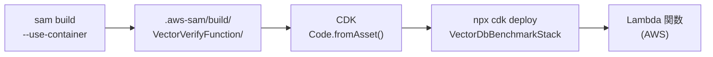
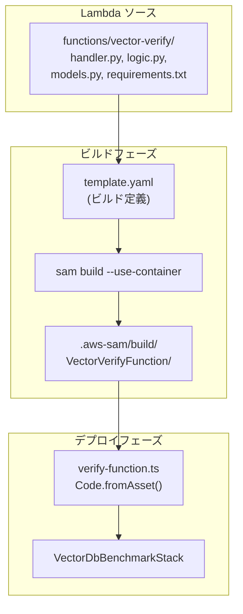

# 設計書: SAM Lambda Migration

## 概要

Lambda 関数のビルド方式を CDK bundling から AWS SAM build に移行する設計。

現在の `lib/constructs/verify-function.ts` では CDK の `bundling` オプションで Python 依存ライブラリをパッケージングしているが、psycopg2 のネイティブバイナリが macOS/ARM 環境でビルドされるため、Lambda 実行環境（x86_64 Linux）で動作しない問題がある。

`sam build --use-container` を使用することで、Docker コンテナ内（Lambda 実行環境と同一の x86_64 Linux）で依存ライブラリをビルドし、この問題を解決する。SAM はビルドツールとしてのみ使用し、デプロイは引き続き CDK が全リソースを一元管理する。

### ワークフロー

```
sam build --use-container → npx cdk deploy
```

### 設計判断の根拠

| 判断 | 理由 |
|------|------|
| SAM はビルド専用 | CDK が全リソースを一元管理し、CloudFormation Export や `!ImportValue` が不要 |
| `--use-container` 必須 | psycopg2 等のネイティブバイナリを Lambda 実行環境と互換性のある形でビルド |
| CDK の `Code.fromAsset` で SAM 出力を参照 | 既存の CDK スタック構造を維持しつつ、ビルド成果物のみ差し替え |
| 単一スタック維持 | VectorDbBenchmarkStack で全リソースを管理する既存方針を継続 |

## アーキテクチャ

### ビルド・デプロイフロー



### コンポーネント関係図



### 変更対象ファイル一覧

| ファイル | 操作 | 内容 |
|----------|------|------|
| `template.yaml` | 新規作成 | SAM ビルド専用テンプレート |
| `lib/constructs/verify-function.ts` | 修正 | bundling 除去、`Code.fromAsset` で `.aws-sam/build/` を参照 |
| `.gitignore` | 修正 | `.aws-sam/` を除外対象に追加 |
| `README.md` | 修正 | デプロイ手順・前提条件を更新 |
| `.kiro/steering/2-technology-stack.md` | 修正 | SAM をビルドツールとして追記 |
| `.kiro/steering/3-implementation-guide.md` | 修正 | SAM build ワークフローを追記 |

## コンポーネントとインターフェース

### 1. SAM テンプレート（template.yaml）

プロジェクトルートに配置するビルド専用の SAM テンプレート。

```yaml
AWSTemplateFormatVersion: "2010-09-09"
Transform: AWS::Serverless-2016-10-31
Description: >
  SAM build template (build only - deployment managed by CDK)

Globals:
  Function:
    Timeout: 300
    Runtime: python3.13
    Architectures:
      - x86_64

Resources:
  VectorVerifyFunction:
    Type: AWS::Serverless::Function
    Properties:
      CodeUri: functions/vector-verify/
      Handler: handler.handler
      Runtime: python3.13
```

ポイント:
- デプロイ設定（VPC、IAM、環境変数等）は含めない（CDK が管理）
- `CodeUri` で Lambda ソースディレクトリを指定
- 将来の Lambda 関数追加は `Resources` にエントリを追加するだけ

### 2. CDK Lambda コンストラクト修正（verify-function.ts）

現在の `bundling` 設定を除去し、SAM ビルド出力を参照する。

変更前:
```typescript
code: lambda.Code.fromAsset("functions/vector-verify", {
  bundling: {
    image: lambda.Runtime.PYTHON_3_13.bundlingImage,
    command: [...],
    local: { tryBundle(...) { ... } },
  },
}),
```

変更後:
```typescript
code: lambda.Code.fromAsset(".aws-sam/build/VectorVerifyFunction"),
```

- IAM ロール、セキュリティグループ、VPC 設定、環境変数等は変更なし
- メモリサイズ、タイムアウト等の Lambda 設定も変更なし
- `Code.fromAsset` のパスのみ変更

### 3. .gitignore 更新

```
# SAM build output
.aws-sam/
```

### 4. ドキュメント更新

- README.md: 前提条件に AWS SAM CLI と Docker を追加、デプロイ手順を更新
- 2-technology-stack.md: SAM をビルドツールとして追記
- 3-implementation-guide.md: SAM build ワークフローを追記

## データモデル

本機能はビルド・デプロイワークフローの変更であり、新規データモデルの追加はない。

### SAM ビルド出力ディレクトリ構造

`sam build --use-container` 実行後の出力:

```
.aws-sam/
└── build/
    └── VectorVerifyFunction/
        ├── handler.py
        ├── logic.py
        ├── models.py
        ├── __init__.py
        ├── psycopg2/          # ネイティブバイナリ（x86_64 Linux）
        ├── opensearchpy/
        ├── aws_lambda_powertools/
        ├── boto3/
        ├── requests_aws4auth/
        └── ... (その他依存ライブラリ)
```

CDK の `Code.fromAsset(".aws-sam/build/VectorVerifyFunction")` はこのディレクトリ全体を Lambda デプロイパッケージとして使用する。


## 正当性プロパティ（Correctness Properties）

*プロパティとは、システムの全ての有効な実行において真であるべき特性や振る舞いのことです。人間が読める仕様と機械で検証可能な正当性保証の橋渡しとなる、形式的な記述です。*

本機能はビルド・デプロイワークフローの変更であり、主にインフラコード（CDK コンストラクト）の正当性を検証する。

### Property 1: SAM ビルド出力参照（bundling 除去）

*任意の* 有効なコンストラクトプロパティに対して、合成された Lambda 関数のコードアセットは `.aws-sam/build/VectorVerifyFunction` ディレクトリを参照し、CDK bundling メタデータを含まないこと。

**Validates: Requirements 2.1, 3.3**

### Property 2: Lambda 非コード設定の保全

*任意の* 有効なコンストラクトプロパティに対して、合成された Lambda 関数は以下の全設定を保持すること: VPC 配置（プライベート分離サブネット）、セキュリティグループ、IAM ロール、環境変数（AURORA_SECRET_ARN、AURORA_CLUSTER_ENDPOINT、POWERTOOLS_SERVICE_NAME、POWERTOOLS_LOG_LEVEL、S3VECTORS_BUCKET_NAME、S3VECTORS_INDEX_NAME）、メモリサイズ（256 MB）、タイムアウト（300 秒）。

**Validates: Requirements 2.2, 2.3**

## エラーハンドリング

### SAM ビルド未実行時のエラー

`sam build` が事前に実行されていない場合（`.aws-sam/build/VectorVerifyFunction` ディレクトリが存在しない場合）、CDK の `Code.fromAsset` はスタック合成時にエラーをスローする。

CDK はデフォルトで `Code.fromAsset` に指定されたパスが存在しない場合、明確なエラーメッセージを出力するため、追加のエラーハンドリングコードは不要。開発者は以下のエラーメッセージから原因を特定できる:

```
Error: Cannot find asset at .aws-sam/build/VectorVerifyFunction
```

対処法: `sam build --use-container` を先に実行する。

### SAM ビルド失敗時

`sam build --use-container` が失敗する主な原因:
- Docker が起動していない → Docker Desktop を起動
- `requirements.txt` に無効なパッケージ名 → パッケージ名を修正
- ネットワーク接続なし → インターネット接続を確認

SAM CLI が適切なエラーメッセージを出力するため、追加のエラーハンドリングは不要。

## テスト戦略

### テスト方針

ユニットテストとプロパティベーステストの両方を使用する。

- **ユニットテスト**: CDK assertions を使用した具体的な設定値の検証
- **プロパティベーステスト**: fast-check を使用した、任意の入力に対する普遍的プロパティの検証

### プロパティベーステスト

ライブラリ: **fast-check**（TypeScript 用プロパティベーステストライブラリ）

各プロパティテストは最低 100 回のイテレーションで実行する。

各テストには設計書のプロパティを参照するコメントタグを付与する:
```
// Feature: sam-lambda-migration, Property 1: SAM ビルド出力参照
// Feature: sam-lambda-migration, Property 2: Lambda 非コード設定の保全
```

各正当性プロパティは単一のプロパティベーステストで実装する。

### ユニットテスト

既存の `test/constructs/verify-function.test.ts` を修正し、以下を検証:

- Lambda 関数が Python 3.13 ランタイムで作成される（既存テスト維持）
- Lambda 関数のメモリが 256 MB である（既存テスト維持）
- Lambda 関数のタイムアウトが 300 秒である（既存テスト維持）
- Lambda 関数が VPC 内に配置される（既存テスト維持）
- Lambda 関数に正しい環境変数が設定される（既存テスト維持）
- IAM ポリシーが正しく設定される（既存テスト維持）

### テスト対象外

- `sam build --use-container` の実行結果（Docker 依存のため CI で別途検証）
- 実際の Lambda デプロイ・実行（E2E テストの範囲）
- ドキュメント内容の検証（レビューで確認）
