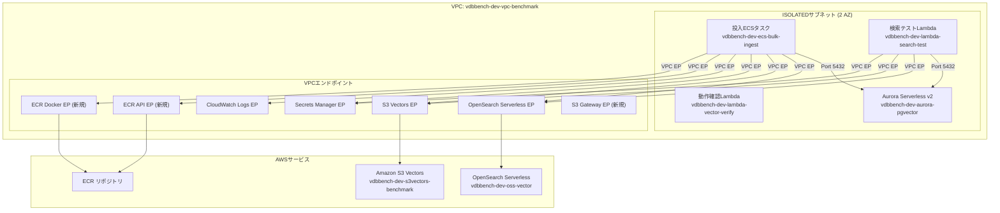

# 技術設計書: ベクトルDB ベンチマーク実行基盤

## 概要

本設計書は、Spec 01 で構築した3つのベクトルデータベース（Aurora pgvector、OpenSearch Serverless、Amazon S3 Vectors）に対して、ECS Fargate タスクによる大量ベクトルデータ一括投入と、Lambda 関数による検索負荷テストを実施するベンチマーク実行基盤の技術設計を定義する。

### 設計方針

- 既存の単一 CDK スタック（VectorDbBenchmarkStack）にリソースを追加
- ECS Fargate はISOLATEDサブネット内で動作（NAT Gateway 不使用、VPCエンドポイント経由）
- データ投入時はインデックス削除→投入→再作成戦略で投入パフォーマンスを最大化
- 検索テストでは投入済みベクトルをクエリベクトルとして再利用し、検索ヒットを保証
- レコード数・検索回数はパラメータ化し、テスト時は少量、本番ベンチマーク時は大量に切り替え可能
- 全リソースに removalPolicy: DESTROY を設定し `cdk destroy` で完全削除可能

### 検索クエリ戦略: 投入ベクトルの再利用

検索テスト Lambda は「投入済みベクトルをクエリベクトルとして使用する」戦略を採用する。

- データ投入時、ECS タスクは決定論的シード（`random.seed(i)` 等）で1536次元ベクトルを生成
- 検索テスト Lambda は同じシードアプローチでクエリベクトルを再生成する
- これにより各クエリは必ず実データにヒットし（distance=0 の完全一致が最低1件）、ベンチマークの妥当性を保証
- クエリベクトルは投入データからランダムにサンプリングした位置のシードで生成

## アーキテクチャ

### 全体構成



### ネットワーク拡張

既存の NetworkConstruct に以下を追加:

| リソース | 種別 | 用途 |
| --- | --- | --- |
| ECR API EP | Interface | ECS Fargate の ECR イメージプル |
| ECR Docker EP | Interface | ECS Fargate の Docker イメージプル |
| S3 Gateway EP | Gateway | ECR イメージレイヤー取得 |
| ECS Fargate SG | SecurityGroup | ECS タスク用通信制御 |

### セキュリティグループ設計（追加分）

| セキュリティグループ | インバウンド | アウトバウンド |
| --- | --- | --- |
| ECS Fargate SG (新規) | なし | Aurora SG:5432, VPC EP SG:443 |
| Aurora SG (既存) | +ECS SG:5432 | 変更なし |
| VPC EP SG (既存) | +ECS SG:443 | 変更なし |


## コンポーネントとインターフェース

### CDK Construct 構成（追加・修正分）

```text
VectorDbBenchmarkStack
├── NetworkConstruct          # 修正: VPCエンドポイント追加、ECS SG追加
├── AuroraConstruct           # 変更なし
├── OpenSearchConstruct       # 変更なし
├── S3VectorsConstruct        # 変更なし
├── VerifyFunctionConstruct   # 変更なし
├── BulkIngestConstruct       # 新規: ECS Fargate タスク定義
└── SearchTestConstruct       # 新規: 検索テスト Lambda 関数
```

### 1. NetworkConstruct 拡張

既存の NetworkConstruct に ECS Fargate 対応のリソースを追加する。

```typescript
// 追加される公開プロパティ
class NetworkConstruct extends Construct {
  // 既存
  readonly vpc: ec2.Vpc;
  readonly lambdaSg: ec2.SecurityGroup;
  readonly auroraSg: ec2.SecurityGroup;
  readonly vpcEndpointSg: ec2.SecurityGroup;
  // 新規
  readonly ecsSg: ec2.SecurityGroup;
}
```

追加リソース:
- ECS Fargate SG: `vdbbench-dev-sg-ecs`
  - Egress: Aurora SG:5432, VPC EP SG:443
- ECR API VPC Endpoint (Interface)
- ECR Docker VPC Endpoint (Interface)
- S3 Gateway VPC Endpoint (Gateway)
- 既存 Aurora SG に ECS SG:5432 インバウンド追加
- 既存 VPC EP SG に ECS SG:443 インバウンド追加

### 2. BulkIngestConstruct（新規）

ECS Fargate タスク定義とクラスターを構築する。

```typescript
interface BulkIngestConstructProps {
  vpc: ec2.Vpc;
  ecsSg: ec2.SecurityGroup;
  auroraCluster: rds.DatabaseCluster;
  auroraSecret: secretsmanager.ISecret;
  opensearchCollectionEndpoint: string;
  s3vectorsBucketName: string;
  s3vectorsIndexName: string;
}

class BulkIngestConstruct extends Construct {
  readonly cluster: ecs.Cluster;
  readonly taskDefinition: ecs.FargateTaskDefinition;
}
```

構成:
- ECS クラスター: `vdbbench-dev-ecs-benchmark`
- タスク定義: メモリ 4096 MB、vCPU 2
- コンテナイメージ: `ecs/bulk-ingest/Dockerfile` からビルド（`ecs.ContainerImage.fromAsset`）
- ログ: CloudWatch Logs（`awslogs` ドライバー）
- 環境変数:
  - `AURORA_SECRET_ARN`
  - `AURORA_CLUSTER_ENDPOINT`
  - `OPENSEARCH_ENDPOINT`
  - `S3VECTORS_BUCKET_NAME`
  - `S3VECTORS_INDEX_NAME`
  - `RECORD_COUNT` (デフォルト: "100000")
- IAM タスクロール権限:
  - `secretsmanager:GetSecretValue` (Aurora Secret)
  - `aoss:APIAccessAll` (OpenSearch)
  - `s3vectors:PutVectors`, `s3vectors:DeleteVectors` (S3 Vectors)

### 3. SearchTestConstruct（新規）

検索負荷テスト用 Lambda 関数を構築する。

```typescript
interface SearchTestConstructProps {
  vpc: ec2.Vpc;
  lambdaSg: ec2.SecurityGroup;
  auroraCluster: rds.DatabaseCluster;
  auroraSecret: secretsmanager.ISecret;
  opensearchCollectionEndpoint: string;
  s3vectorsBucketName: string;
  s3vectorsIndexName: string;
}

class SearchTestConstruct extends Construct {
  readonly function: lambda.Function;
}
```

構成:
- 関数名: `vdbbench-dev-lambda-search-test`
- ランタイム: Python 3.13
- メモリ: 512 MB
- タイムアウト: 300 秒
- VPC 配置: ISOLATED サブネット
- セキュリティグループ: 既存の Lambda SG を共用
- 環境変数: BulkIngestConstruct と同様 + `POWERTOOLS_SERVICE_NAME: search-test`
- IAM 権限:
  - `secretsmanager:GetSecretValue` (Aurora Secret)
  - `aoss:APIAccessAll` (OpenSearch)
  - `s3vectors:QueryVectors`, `s3vectors:GetVectors` (S3 Vectors)

### ECS タスク Python コード構成

```text
ecs/bulk-ingest/
├── Dockerfile
├── requirements.txt
├── main.py              # エントリポイント
├── ingestion.py         # DB別投入ロジック
├── index_manager.py     # インデックス削除・再作成
├── vector_generator.py  # 決定論的ベクトル生成
└── metrics.py           # メトリクス収集・出力
```

### 検索テスト Lambda コード構成

```text
functions/search-test/
├── handler.py           # Lambda エントリポイント
├── logic.py             # 検索ロジック・メトリクス算出
├── models.py            # データモデル
├── vector_generator.py  # クエリベクトル再生成（同一シード）
└── requirements.txt     # 依存ライブラリ
```

### SAM テンプレート更新

`template.yaml` に検索テスト Lambda のエントリを追加:

```yaml
Resources:
  VectorVerifyFunction:
    Type: AWS::Serverless::Function
    Properties:
      CodeUri: functions/vector-verify/
      Handler: handler.handler
      Runtime: python3.13

  SearchTestFunction:
    Type: AWS::Serverless::Function
    Properties:
      CodeUri: functions/search-test/
      Handler: handler.handler
      Runtime: python3.13
```


## データモデル

### 決定論的ベクトル生成

投入 ECS タスクと検索テスト Lambda の両方で同一のベクトルを再現するため、決定論的シードによるベクトル生成を採用する。

```python
import random

VECTOR_DIMENSION = 1536

def generate_vector(seed: int) -> list[float]:
    """決定論的シードから1536次元ベクトルを生成する."""
    rng = random.Random(seed)
    return [rng.uniform(-1.0, 1.0) for _ in range(VECTOR_DIMENSION)]

def generate_query_vectors(
    record_count: int,
    search_count: int,
) -> list[list[float]]:
    """投入済みデータからランダムにサンプリングしたクエリベクトルを生成する.

    投入時と同じシードを使用するため、各クエリは必ず実データにヒットする。
    """
    rng = random.Random(42)  # サンプリング用の固定シード
    indices = [rng.randint(0, record_count - 1) for _ in range(search_count)]
    return [generate_vector(i) for i in indices]
```

- 各ベクトルのシードはインデックス番号 `i` (0〜record_count-1)
- 検索テスト Lambda は `generate_vector(i)` で同一ベクトルを再生成
- クエリベクトルは投入データのサブセットなので、distance=0 の完全一致が保証される

### ECS タスク投入メトリクスモデル

```python
@dataclass
class IngestionPhaseMetrics:
    """各フェーズの計測結果."""
    phase: str              # "index_drop", "data_insert", "index_create"
    duration_seconds: float
    record_count: int       # data_insert フェーズのみ有効

@dataclass
class DatabaseIngestionResult:
    """各DBの投入結果."""
    database: str           # "aurora_pgvector", "opensearch", "s3vectors"
    phases: list[IngestionPhaseMetrics]
    total_duration_seconds: float
    throughput_records_per_sec: float
    record_count: int
    success: bool
    error_message: str | None = None

@dataclass
class IngestionReport:
    """投入ECSタスク全体のレポート."""
    aurora: DatabaseIngestionResult
    opensearch: DatabaseIngestionResult
    s3vectors: DatabaseIngestionResult
    record_count: int
    vector_dimension: int
```

### 検索テスト Lambda イベントモデル

```python
@dataclass
class SearchTestEvent:
    """検索テスト Lambda のイベントペイロード."""
    search_count: int = 100   # クエリ実行回数
    top_k: int = 10           # 近傍返却件数
    record_count: int = 100000  # 投入済みレコード数（クエリベクトル生成用）
```

### 検索テスト Lambda レスポンスモデル

```python
@dataclass
class LatencyStats:
    """レイテンシ統計."""
    avg_ms: float
    p50_ms: float
    p95_ms: float
    p99_ms: float
    min_ms: float
    max_ms: float

@dataclass
class DatabaseSearchResult:
    """各DBの検索結果."""
    database: str
    latency: LatencyStats
    throughput_qps: float     # クエリ/秒
    search_count: int
    top_k: int
    success: bool
    error_message: str | None = None

@dataclass
class SearchTestResponse:
    """検索テスト Lambda 全体のレスポンス."""
    aurora: DatabaseSearchResult
    opensearch: DatabaseSearchResult
    s3vectors: DatabaseSearchResult
    search_count: int
    top_k: int
    comparison: list[dict[str, object]]  # 比較表形式
```

### レイテンシ算出ロジック

```python
import numpy as np

def calculate_latency_stats(latencies_ms: list[float]) -> LatencyStats:
    """レイテンシのリストから統計値を算出する."""
    arr = sorted(latencies_ms)
    return LatencyStats(
        avg_ms=sum(arr) / len(arr),
        p50_ms=arr[len(arr) // 2],
        p95_ms=arr[int(len(arr) * 0.95)],
        p99_ms=arr[int(len(arr) * 0.99)],
        min_ms=arr[0],
        max_ms=arr[-1],
    )
```

注: numpy は Lambda パッケージサイズ増大を避けるため使用せず、標準ライブラリのみで実装する。

### Aurora インデックス操作 SQL

```sql
-- インデックス削除
DROP INDEX IF EXISTS embeddings_hnsw_idx;

-- テーブルデータ削除（再投入のため）
TRUNCATE TABLE embeddings;

-- バッチ INSERT（1000件単位）
INSERT INTO embeddings (content, embedding)
VALUES (%s, %s::vector), (%s, %s::vector), ...;

-- インデックス再作成
CREATE INDEX embeddings_hnsw_idx
    ON embeddings USING hnsw (embedding vector_cosine_ops)
    WITH (m = 16, ef_construction = 64);
```

### OpenSearch インデックス操作

```python
# インデックス削除
client.indices.delete(index="embeddings")

# インデックス再作成（HNSWマッピング付き）
client.indices.create(index="embeddings", body={
    "settings": {
        "index": {"knn": True, "knn.algo_param.ef_search": 100}
    },
    "mappings": {
        "properties": {
            "id": {"type": "integer"},
            "content": {"type": "text"},
            "embedding": {
                "type": "knn_vector",
                "dimension": 1536,
                "method": {
                    "name": "hnsw",
                    "space_type": "cosinesimil",
                    "engine": "faiss",
                    "parameters": {"m": 16, "ef_construction": 64}
                }
            }
        }
    }
})

# Bulk API 投入
bulk_body = []
for i, vec in enumerate(vectors):
    bulk_body.append({"index": {"_index": "embeddings", "_id": str(i)}})
    bulk_body.append({"id": i, "content": f"doc-{i}", "embedding": vec})
client.bulk(body=bulk_body)
```

### ECS Dockerfile

```dockerfile
FROM python:3.13-slim

WORKDIR /app
COPY requirements.txt .
RUN pip install --no-cache-dir -r requirements.txt
COPY . .

ENTRYPOINT ["python", "main.py"]
```


## 正当性プロパティ

*プロパティとは、システムのすべての有効な実行において真であるべき特性や振る舞いのことである。人間が読める仕様と機械的に検証可能な正当性保証の橋渡しとなる形式的な記述である。*

### プロパティ 1: 決定論的ベクトル生成の正確性

*任意の* 正の整数 record_count に対して、`generate_vector(seed)` を seed=0 から seed=record_count-1 まで呼び出した場合、各ベクトルは長さ 1536 のリストであり、すべての要素は -1.0 以上 1.0 以下の浮動小数点数であること。また、同一の seed に対して `generate_vector` を複数回呼び出した場合、常に同一のベクトルが返却されること（決定論性）。

**検証対象: 要件 4.1, 7.1**

### プロパティ 2: バッチ投入の呼び出し回数

*任意の* 正の整数 record_count と正の整数 batch_size に対して、バッチ投入関数が発行するバッチ API 呼び出し回数は `ceil(record_count / batch_size)` に等しいこと。これは Aurora（バッチ INSERT）、OpenSearch（Bulk API）、S3 Vectors（PutVectors バッチ）の全 DB アダプターに共通して成立すること。

**検証対象: 要件 4.4, 4.5, 4.6**

### プロパティ 3: スループット算出の正確性

*任意の* 正の整数 record_count と正の浮動小数点数 duration_seconds に対して、算出されるスループットは `record_count / duration_seconds` に等しいこと。

**検証対象: 要件 4.8, 6.2**

### プロパティ 4: 検索クエリ実行回数とレイテンシ追跡

*任意の* 正の整数 search_count に対して、検索テスト関数は各 DB に対して正確に search_count 回のクエリを実行し、search_count 個のレイテンシ計測値を記録すること。

**検証対象: 要件 5.3, 5.4, 7.3**

### プロパティ 5: レイテンシ統計算出の正確性

*任意の* 正の浮動小数点数のリスト（長さ1以上）に対して、`calculate_latency_stats` が返す統計値は以下を満たすこと: P50 は中央値、P95 は 95 パーセンタイル値、P99 は 99 パーセンタイル値であり、min <= P50 <= P95 <= P99 <= max かつ min <= avg <= max が成立すること。

**検証対象: 要件 5.5, 6.3**

### プロパティ 6: フェーズ所要時間の合計一致

*任意の* DatabaseIngestionResult に対して、phases 内の各 IngestionPhaseMetrics の duration_seconds の合計は total_duration_seconds と等しい（浮動小数点誤差を許容）こと。

**検証対象: 要件 6.1**

### プロパティ 7: 全リソースの削除ポリシー

*任意の* 合成された CloudFormation テンプレート内の DeletionPolicy をサポートするリソース（ECS タスク定義、ECS クラスター、ECR リポジトリ、検索テスト Lambda 等の追加リソース）に対して、その DeletionPolicy は "Delete" に設定されていること。

**検証対象: 要件 8.1, 8.2**

### プロパティ 8: クエリベクトル決定論的再生成（ラウンドトリップ）

*任意の* 有効なインデックス i（0 <= i < record_count）に対して、投入時に `generate_vector(i)` で生成したベクトルと、検索テスト時に `generate_vector(i)` で再生成したベクトルは完全に一致すること。これにより検索クエリが必ず実データにヒットすることを保証する。

**検証対象: 要件 5.3（検索ヒット保証）**

## エラーハンドリング

### ECS タスクのエラーハンドリング

| エラー種別 | 対処方法 | 動作 |
| --- | --- | --- |
| Aurora 接続失敗 | リトライ（最大3回、2秒間隔） | 失敗時は Aurora 投入をスキップし次の DB へ |
| インデックス削除失敗 | エラーログ記録 | 該当 DB の投入処理を中断、次の DB へ |
| バッチ投入失敗 | リトライ（最大3回） | 失敗時はエラーログ記録、次の DB へ |
| インデックス再作成失敗 | エラーログ記録 | 該当 DB のメトリクスに失敗を記録 |
| OpenSearch 接続失敗 | リトライ（最大3回） | 失敗時は OpenSearch 投入をスキップ |
| S3 Vectors API 失敗 | リトライ（最大3回） | 失敗時は S3 Vectors 投入をスキップ |

各 DB の投入処理は独立して実行される。1つの DB で失敗しても残りの DB は継続する。

### 検索テスト Lambda のエラーハンドリング

| エラー種別 | 対処方法 | 動作 |
| --- | --- | --- |
| Aurora 接続失敗 | リトライ（最大3回） | 失敗時は success=false、error_message に詳細 |
| OpenSearch 接続失敗 | リトライ（最大3回） | 失敗時は success=false、error_message に詳細 |
| S3 Vectors API 失敗 | リトライ（最大3回） | 失敗時は success=false、error_message に詳細 |
| 個別クエリ失敗 | スキップしてカウント | 失敗クエリはレイテンシ計測から除外 |
| パラメータ不正 | バリデーションエラー | 400 相当のエラーレスポンス |

### CDK スタックのエラーハンドリング

- cdk-nag 違反: デプロイ前にエラーとして検出、抑制理由をコメントで明記
- ECS タスク定義の循環依存: Construct 間の明示的な依存関係定義で回避
- SAM ビルド未実行: `Code.fromAsset` がディレクトリ不在時にエラーをスロー

### Powertools for AWS Lambda の活用

検索テスト Lambda では既存の動作確認 Lambda と同様に Powertools を使用:

```python
from aws_lambda_powertools import Logger, Tracer

logger = Logger(service="search-test")
tracer = Tracer(service="search-test")
```

ECS タスクでは標準の `logging` モジュールと `structlog` で構造化ログを出力:

```python
import structlog

logger = structlog.get_logger()
logger.info("ingestion_complete", database="aurora_pgvector",
            record_count=100000, duration_seconds=45.2)
```

## テスト戦略

### テストの二重アプローチ

ユニットテストとプロパティベーステストの両方を実施する。

- ユニットテスト: 特定の具体例、エッジケース、エラー条件を検証
- プロパティテスト: すべての入力に対して普遍的に成立するプロパティを検証

### プロパティベーステスト

ライブラリ:
- Python: Hypothesis（ECS タスク・Lambda のロジックテスト）
- TypeScript: fast-check（CDK コンストラクトのプロパティテスト）

各プロパティテストは最低 100 回のイテレーションを実行する。
各テストには設計書のプロパティ番号をタグ付けする。
タグ形式: `Feature: 03-vector-benchmark-execution, Property {番号}: {プロパティ名}`
各正当性プロパティは単一のプロパティベーステストで実装する。

### テスト対象と手法の対応

| テスト対象 | 手法 | ツール |
| --- | --- | --- |
| VPCエンドポイント追加（ECR API, ECR Docker, S3 GW） | ユニットテスト | Jest (CDK assertions) |
| ECS SG 作成・ルール | ユニットテスト | Jest (CDK assertions) |
| ECS タスク定義（メモリ、vCPU、環境変数） | ユニットテスト | Jest (CDK assertions) |
| 検索テスト Lambda 構成（VPC、メモリ、IAM） | ユニットテスト | Jest (CDK assertions) |
| cdk-nag セキュリティチェック | ユニットテスト | Jest (cdk-nag) |
| 決定論的ベクトル生成 | プロパティテスト | Hypothesis |
| バッチ投入呼び出し回数 | プロパティテスト | Hypothesis |
| スループット算出 | プロパティテスト | Hypothesis |
| レイテンシ統計算出 | プロパティテスト | Hypothesis |
| フェーズ所要時間合計 | プロパティテスト | Hypothesis |
| クエリベクトル決定論的再生成 | プロパティテスト | Hypothesis |
| 削除ポリシー一貫性 | プロパティテスト | fast-check |
| インデックス削除→投入→再作成の順序 | ユニットテスト | pytest (mock) |
| エラー時のリトライ・スキップ動作 | ユニットテスト | pytest (mock) |
| デフォルトパラメータ値 | ユニットテスト | pytest |
| 検索テスト Lambda ハンドラー | ユニットテスト | pytest (mock) |

### テストディレクトリ構成

```text
test/
  constructs/
    network.test.ts              # 修正: VPCエンドポイント追加テスト
    bulk-ingest.test.ts          # 新規: BulkIngestConstruct テスト
    search-test.test.ts          # 新規: SearchTestConstruct テスト
  integration/
    stack-nag.test.ts            # 修正: 新規リソースの cdk-nag テスト
    stack-properties.test.ts     # 修正: 削除ポリシープロパティテスト

tests/
  ecs/
    bulk_ingest/
      test_vector_generator.py   # ベクトル生成テスト（プロパティテスト含む）
      test_ingestion.py          # 投入ロジックテスト
      test_index_manager.py      # インデックス操作テスト
      test_metrics.py            # メトリクス算出テスト（プロパティテスト含む）
  functions/
    search_test/
      test_logic.py              # 検索ロジックテスト（プロパティテスト含む）
      test_models.py             # データモデルテスト
      test_handler.py            # ハンドラーテスト
```

