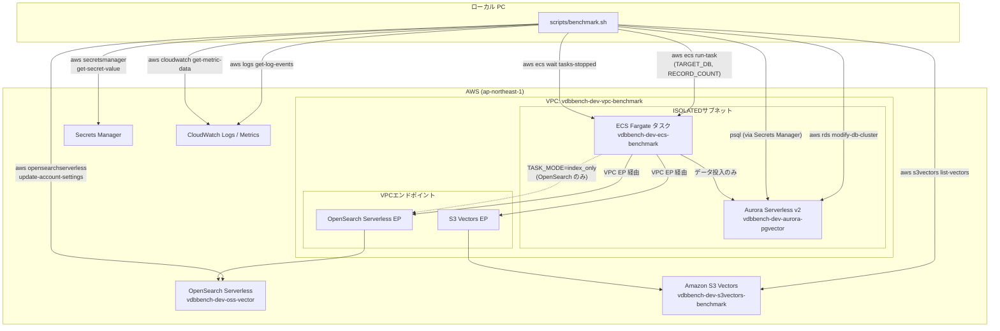
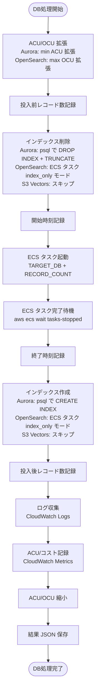

# 技術設計書: ベンチマークシェルスクリプト

## 概要

本設計書は、ローカル PC 上で実行するベンチマークシェルスクリプト（`scripts/benchmark.sh`）の技術設計を定義する。
本スクリプトは Spec 03 で構築した ECS Fargate タスクを活用し、3つのベクトルデータベース（Aurora pgvector、OpenSearch Serverless、Amazon S3 Vectors）に対して、ACU/OCU スケーリング・インデックス操作・データ投入・メトリクス収集を一貫して自動実行する。

### 設計方針

- シェルスクリプトはローカル PC 上で実行し、AWS CLI で全 AWS リソースを操作する
- ECS タスクの役割はデータ投入のみに限定し、インデックス操作・スケーリングはシェルスクリプト側で制御する
- 既存の ECS タスク（`main.py`）に `TARGET_DB` 環境変数を追加し、単一 DB 指定モードをサポートする
- OpenSearch Serverless は VPC ネットワークポリシーにより VPC 内からのみアクセス可能なため、インデックス操作は ECS タスク経由で実行する（方法 A を採用）
- 1回の実行で Aurora → OpenSearch → S3 Vectors の順に3つの DB 全てのベンチマークサイクルを自動完了する
- エラー発生時も ACU/OCU を確実に元に戻すクリーンアップ処理を実装する

### OpenSearch VPC アクセス制限への対応方針

要件 4 の補足に記載された3つの方法を検討した結果、**方法 A（ECS タスクにインデックス操作モードを追加）** を採用する。

| 方法 | 概要 | メリット | デメリット |
| --- | --- | --- | --- |
| A: ECS タスク経由 | ECS タスクに `TASK_MODE=index_only` モードを追加 | 既存コード（index_manager.py）を再利用可能、新規リソース不要 | ECS タスク起動のオーバーヘッド（コンテナ起動に30-60秒） |
| B: Lambda 関数 | 新規 Lambda を作成し `aws lambda invoke` で呼び出し | 起動が高速 | 新規 Lambda の作成・デプロイが必要、CDK スタック変更が必要（スコープ外） |
| C: ECS タスク例外 | `TARGET_DB=opensearch` の場合のみインデックス操作を含む | 実装が最も簡単 | Aurora/S3 Vectors と動作が不一致、シェルスクリプトの制御フローが複雑化 |

**方法 A を選択した理由:**
1. CDK スタックの変更がスコープ外であるため、新規 Lambda（方法 B）は不適切
2. 既存の `index_manager.py`（`OpenSearchIndexManager`）のコードをそのまま再利用できる
3. 3つの DB 全てで「シェルスクリプトがインデックス操作を制御する」という一貫したアーキテクチャを維持できる
4. ECS タスク起動のオーバーヘッドはベンチマーク全体（10万件投入）の所要時間に比べて無視できる


## アーキテクチャ

### 全体構成



### ベンチマークサイクルフロー

各 DB に対して以下のサイクルを順次実行する:




## コンポーネントとインターフェース

### コンポーネント構成

```text
scripts/
  benchmark.sh              # メインベンチマークスクリプト

ecs/bulk-ingest/
  main.py                   # 修正: TARGET_DB / TASK_MODE 環境変数対応
  index_manager.py          # 変更なし（ECS タスク index_only モードで再利用）
  ingestion.py              # 変更なし
  metrics.py                # 変更なし
  vector_generator.py       # 変更なし
```

### 1. ECS タスク main.py の修正

既存の `main.py` に2つの環境変数を追加する。

| 環境変数 | 値 | 動作 |
| --- | --- | --- |
| `TARGET_DB` | 未設定 / `all` | 既存動作（3DB 順次処理、インデックス操作含む） |
| `TARGET_DB` | `aurora` | Aurora のみデータ投入（インデックス操作なし） |
| `TARGET_DB` | `opensearch` | OpenSearch のみデータ投入（インデックス操作なし） |
| `TARGET_DB` | `s3vectors` | S3 Vectors のみデータ投入（インデックス操作なし） |
| `TARGET_DB` | その他 | エラーログ出力、終了コード 1 |
| `TASK_MODE` | 未設定 / `ingest` | データ投入モード（デフォルト） |
| `TASK_MODE` | `index_drop` | インデックス削除のみ実行 |
| `TASK_MODE` | `index_create` | インデックス作成のみ実行 |

`TASK_MODE` は OpenSearch のインデックス操作をシェルスクリプトから ECS タスク経由で実行するために使用する。
`TARGET_DB` が単一 DB 指定かつ `TASK_MODE` が `ingest`（デフォルト）の場合、インデックス操作をスキップしデータ投入のみ実行する。

```python
# main.py の修正イメージ
def main() -> None:
    target_db = os.environ.get("TARGET_DB", "all").lower()
    task_mode = os.environ.get("TASK_MODE", "ingest").lower()

    valid_targets = {"all", "aurora", "opensearch", "s3vectors"}
    if target_db not in valid_targets:
        logger.error("invalid_target_db", target_db=target_db)
        sys.exit(1)

    valid_modes = {"ingest", "index_drop", "index_create"}
    if task_mode not in valid_modes:
        logger.error("invalid_task_mode", task_mode=task_mode)
        sys.exit(1)

    if task_mode == "index_drop":
        # インデックス削除のみ（OpenSearch 用）
        _run_index_operation(target_db, "drop")
        return

    if task_mode == "index_create":
        # インデックス作成のみ（OpenSearch 用）
        _run_index_operation(target_db, "create")
        return

    # データ投入モード
    if target_db == "all":
        # 既存動作: 3DB 順次処理（インデックス操作含む）
        _run_all_databases(record_count)
    else:
        # 単一 DB: データ投入のみ（インデックス操作なし）
        _run_single_database(target_db, record_count)
```

### 2. シェルスクリプト（scripts/benchmark.sh）

#### 前提条件チェック

スクリプト実行開始時に以下を確認する:

- `aws` CLI コマンドの存在
- `psql` コマンドの存在
- `jq` コマンドの存在
- AWS 認証情報の有効性（`aws sts get-caller-identity`）

#### コマンドライン引数

```bash
scripts/benchmark.sh [OPTIONS]

Options:
  --record-count N              投入レコード数 (デフォルト: 100000)
  --aurora-cluster ID           Aurora クラスター識別子 (デフォルト: vdbbench-dev-aurora-pgvector)
  --opensearch-collection NAME  OpenSearch コレクション名 (デフォルト: vdbbench-dev-oss-vector)
  --s3vectors-bucket NAME       S3 Vectors バケット名 (デフォルト: vdbbench-dev-s3vectors-benchmark)
  --ecs-cluster NAME            ECS クラスター名 (デフォルト: vdbbench-dev-ecs-benchmark)
  --region REGION               AWS リージョン (デフォルト: ap-northeast-1)
  --aurora-min-acu N            ACU 拡張時の最小値 (デフォルト: 8)
  --opensearch-max-ocu N        OCU 拡張時の上限値 (デフォルト: 10)
  --help                        ヘルプ表示
```

#### 主要関数構成

| 関数名 | 責務 |
| --- | --- |
| `main` | 全体フロー制御、結果ディレクトリ作成、サマリー生成 |
| `check_prerequisites` | 前提条件チェック（aws, psql, jq, 認証情報） |
| `parse_args` | コマンドライン引数パース |
| `run_benchmark_cycle` | 1つの DB に対するベンチマークサイクル全体 |
| `scale_aurora_up` / `scale_aurora_down` | Aurora ACU スケーリング |
| `scale_opensearch_up` / `scale_opensearch_down` | OpenSearch OCU スケーリング |
| `wait_aurora_available` | Aurora クラスターの available 待機 |
| `drop_aurora_index` / `create_aurora_index` | Aurora インデックス操作（psql 経由） |
| `drop_opensearch_index` / `create_opensearch_index` | OpenSearch インデックス操作（ECS タスク経由） |
| `get_aurora_credentials` | Secrets Manager から Aurora 認証情報取得 |
| `run_ecs_task` | ECS タスク起動・待機 |
| `get_record_count` | 各 DB のレコード数取得 |
| `collect_task_logs` | CloudWatch Logs からログ収集 |
| `collect_aurora_metrics` | Aurora ACU メトリクス取得 |
| `calculate_fargate_cost` | Fargate 概算コスト算出 |
| `save_result_json` | 個別 DB 結果 JSON 保存 |
| `generate_summary` | 全 DB 統合サマリー生成 |
| `cleanup` | trap 用クリーンアップ（ACU/OCU 復元） |
| `log_info` / `log_error` / `log_separator` | ログ出力ユーティリティ |

#### Aurora インデックス操作（psql 経由）

```bash
# Secrets Manager から認証情報取得
get_aurora_credentials() {
    local secret_json
    secret_json=$(aws secretsmanager get-secret-value \
        --secret-id "$AURORA_SECRET_ARN" \
        --query 'SecretString' --output text \
        --region "$REGION")
    AURORA_HOST=$(echo "$secret_json" | jq -r '.host')
    AURORA_PORT=$(echo "$secret_json" | jq -r '.port // 5432')
    AURORA_USER=$(echo "$secret_json" | jq -r '.username')
    AURORA_PASSWORD=$(echo "$secret_json" | jq -r '.password')
    AURORA_DBNAME=$(echo "$secret_json" | jq -r '.dbname // "postgres"')
}

# インデックス削除 + TRUNCATE
drop_aurora_index() {
    PGPASSWORD="$AURORA_PASSWORD" psql \
        -h "$AURORA_HOST" -p "$AURORA_PORT" \
        -U "$AURORA_USER" -d "$AURORA_DBNAME" \
        -c "DROP INDEX IF EXISTS embeddings_hnsw_idx;" \
        -c "TRUNCATE TABLE embeddings;"
}

# インデックス再作成
create_aurora_index() {
    PGPASSWORD="$AURORA_PASSWORD" psql \
        -h "$AURORA_HOST" -p "$AURORA_PORT" \
        -U "$AURORA_USER" -d "$AURORA_DBNAME" \
        -c "CREATE INDEX embeddings_hnsw_idx ON embeddings \
            USING hnsw (embedding vector_cosine_ops) \
            WITH (m = 16, ef_construction = 64);"
}
```

#### OpenSearch インデックス操作（ECS タスク経由）

OpenSearch は VPC ネットワークポリシーによりローカル PC から直接アクセスできないため、ECS タスクの `TASK_MODE` を使用してインデックス操作を実行する。

```bash
# OpenSearch インデックス削除
drop_opensearch_index() {
    run_ecs_task_with_mode "opensearch" "index_drop"
}

# OpenSearch インデックス作成
create_opensearch_index() {
    run_ecs_task_with_mode "opensearch" "index_create"
}

# ECS タスクを指定モードで起動・待機
run_ecs_task_with_mode() {
    local target_db="$1"
    local task_mode="$2"
    local task_arn

    task_arn=$(aws ecs run-task \
        --cluster "$ECS_CLUSTER" \
        --task-definition "$TASK_DEFINITION" \
        --launch-type FARGATE \
        --network-configuration "..." \
        --overrides '{
            "containerOverrides": [{
                "name": "BulkIngestContainer",
                "environment": [
                    {"name": "TARGET_DB", "value": "'"$target_db"'"},
                    {"name": "TASK_MODE", "value": "'"$task_mode"'"}
                ]
            }]
        }' \
        --query 'tasks[0].taskArn' --output text \
        --region "$REGION")

    aws ecs wait tasks-stopped \
        --cluster "$ECS_CLUSTER" \
        --tasks "$task_arn" \
        --region "$REGION"
}
```

#### ECS タスク起動（データ投入）

```bash
run_ecs_task() {
    local target_db="$1"
    local record_count="$2"

    START_TIME=$(date -u +"%Y-%m-%dT%H:%M:%SZ")

    TASK_ARN=$(aws ecs run-task \
        --cluster "$ECS_CLUSTER" \
        --task-definition "$TASK_DEFINITION" \
        --launch-type FARGATE \
        --network-configuration "..." \
        --overrides '{
            "containerOverrides": [{
                "name": "BulkIngestContainer",
                "environment": [
                    {"name": "TARGET_DB", "value": "'"$target_db"'"},
                    {"name": "TASK_MODE", "value": "ingest"},
                    {"name": "RECORD_COUNT", "value": "'"$record_count"'"}
                ]
            }]
        }' \
        --query 'tasks[0].taskArn' --output text \
        --region "$REGION")

    aws ecs wait tasks-stopped \
        --cluster "$ECS_CLUSTER" \
        --tasks "$TASK_ARN" \
        --region "$REGION"

    END_TIME=$(date -u +"%Y-%m-%dT%H:%M:%SZ")

    # 終了コード確認
    EXIT_CODE=$(aws ecs describe-tasks \
        --cluster "$ECS_CLUSTER" \
        --tasks "$TASK_ARN" \
        --query 'tasks[0].containers[0].exitCode' --output text \
        --region "$REGION")
}
```

#### レコード数取得

```bash
# Aurora: psql 経由
get_aurora_record_count() {
    PGPASSWORD="$AURORA_PASSWORD" psql \
        -h "$AURORA_HOST" -p "$AURORA_PORT" \
        -U "$AURORA_USER" -d "$AURORA_DBNAME" \
        -t -A -c "SELECT COUNT(*) FROM embeddings;"
}

# OpenSearch: ECS タスク経由（VPC 制限のため直接アクセス不可）
# → ECS タスクに count モードを追加するか、投入後のログから取得する
# 設計判断: ECS タスクのログ出力（ingest_all_complete の total_inserted）から取得する
get_opensearch_record_count() {
    # ECS タスクログから total_inserted を抽出
    # または、投入前は 0（TRUNCATE 後）、投入後は RECORD_COUNT と見なす
    echo "$RECORD_COUNT"
}

# S3 Vectors: AWS CLI 経由
get_s3vectors_record_count() {
    aws s3vectors list-vectors \
        --vector-bucket-name "$S3VECTORS_BUCKET" \
        --index-name "embeddings" \
        --query 'vectors | length(@)' --output text \
        --region "$REGION" 2>/dev/null || echo "0"
}
```

#### クリーンアップ処理

```bash
cleanup() {
    log_info "クリーンアップ処理を実行中..."

    # Aurora ACU を元に戻す
    if [[ "$AURORA_SCALED_UP" == "true" ]]; then
        log_info "Aurora ACU を元の値に戻しています..."
        aws rds modify-db-cluster \
            --db-cluster-identifier "$AURORA_CLUSTER" \
            --serverless-v2-scaling-configuration \
            "MinCapacity=0,MaxCapacity=16" \
            --apply-immediately \
            --region "$REGION" 2>/dev/null || true
    fi

    # OpenSearch OCU を元に戻す
    if [[ "$OPENSEARCH_SCALED_UP" == "true" ]]; then
        log_info "OpenSearch OCU を元の値に戻しています..."
        aws opensearchserverless update-account-settings \
            --capacity-limits "maxIndexingCapacityInOCU=2,maxSearchCapacityInOCU=2" \
            --region "$REGION" 2>/dev/null || true
    fi

    log_info "クリーンアップ完了"
}

trap cleanup EXIT
```


## データモデル

### 個別 DB 結果 JSON（例: aurora-result.json）

```json
{
  "database": "aurora_pgvector",
  "record_count": 100000,
  "pre_count": 0,
  "post_count": 100000,
  "start_time": "2025-01-15T10:00:00Z",
  "end_time": "2025-01-15T10:05:30Z",
  "duration_seconds": 330,
  "throughput_records_per_sec": 303.03,
  "index_drop_success": true,
  "index_create_success": true,
  "ecs_task_arn": "arn:aws:ecs:ap-northeast-1:123456789012:task/vdbbench-dev-ecs-benchmark/abc123",
  "ecs_exit_code": 0,
  "acu_before": 0,
  "acu_during": 8,
  "acu_after": 0,
  "success": true,
  "error_message": null
}
```

### サマリー JSON（summary.json）

```json
{
  "benchmark_id": "20250115-100000",
  "region": "ap-northeast-1",
  "record_count": 100000,
  "vector_dimension": 1536,
  "results": {
    "aurora_pgvector": {
      "duration_seconds": 330,
      "throughput_records_per_sec": 303.03,
      "pre_count": 0,
      "post_count": 100000,
      "success": true
    },
    "opensearch": {
      "duration_seconds": 450,
      "throughput_records_per_sec": 222.22,
      "pre_count": 0,
      "post_count": 100000,
      "success": true
    },
    "s3vectors": {
      "duration_seconds": 200,
      "throughput_records_per_sec": 500.00,
      "pre_count": 0,
      "post_count": 100000,
      "success": true
    }
  },
  "cost_summary": {
    "aurora_acu_peak": 8,
    "opensearch_ocu_max": 10,
    "fargate_total_seconds": 980,
    "fargate_vcpu": 2,
    "fargate_memory_gb": 4,
    "fargate_estimated_cost_usd": 0.05
  },
  "total_duration_seconds": 1200,
  "completed_at": "2025-01-15T10:20:00Z"
}
```

### コスト概算ロジック

```bash
# Fargate コスト概算（ap-northeast-1 料金）
# vCPU: $0.05056/時間, メモリ: $0.00553/GB/時間
calculate_fargate_cost() {
    local duration_seconds="$1"
    local vcpu=2
    local memory_gb=4
    local hours
    hours=$(echo "scale=6; $duration_seconds / 3600" | bc)
    local vcpu_cost
    vcpu_cost=$(echo "scale=6; $hours * $vcpu * 0.05056" | bc)
    local memory_cost
    memory_cost=$(echo "scale=6; $hours * $memory_gb * 0.00553" | bc)
    echo "scale=4; $vcpu_cost + $memory_cost" | bc
}
```

### ベンチマーク結果ディレクトリ構造

```text
results/
  YYYYMMDD-HHMMSS/
    aurora-result.json          # Aurora 個別結果
    opensearch-result.json      # OpenSearch 個別結果
    s3vectors-result.json       # S3 Vectors 個別結果
    aurora-task.log             # Aurora ECS タスクログ
    opensearch-task.log         # OpenSearch ECS タスクログ
    opensearch-index-drop.log   # OpenSearch インデックス削除タスクログ
    opensearch-index-create.log # OpenSearch インデックス作成タスクログ
    s3vectors-task.log          # S3 Vectors ECS タスクログ
    cost-summary.json           # コストサマリー
    summary.json                # 全体サマリー
```

### ECS タスク TASK_MODE 別の動作マトリクス

| TARGET_DB | TASK_MODE | 実行内容 |
| --- | --- | --- |
| `aurora` | `ingest` | Aurora データ投入のみ |
| `opensearch` | `ingest` | OpenSearch データ投入のみ |
| `s3vectors` | `ingest` | S3 Vectors データ投入のみ |
| `opensearch` | `index_drop` | OpenSearch インデックス削除のみ |
| `opensearch` | `index_create` | OpenSearch インデックス作成のみ |
| `all` | `ingest` | 3DB 順次処理（インデックス操作含む、後方互換） |


## 正当性プロパティ

*プロパティとは、システムのすべての有効な実行において真であるべき特性や振る舞いのことである。人間が読める仕様と機械的に検証可能な正当性保証の橋渡しとなる形式的な記述である。*

### プロパティ 1: TARGET_DB ルーティングの正確性

*任意の* 有効な単一 DB ターゲット（`aurora`、`opensearch`、`s3vectors` のいずれか）に対して、`TARGET_DB` にその値が設定され `TASK_MODE` が `ingest` の場合、ECS タスクは指定された DB のデータ投入のみを実行し、他の DB の処理およびインデックス操作（drop_index / create_index）は一切実行しないこと。

**検証対象: 要件 1.1, 1.2, 1.3, 1.6**

### プロパティ 2: 無効な TARGET_DB の拒否

*任意の* 文字列で、有効な TARGET_DB 値の集合（`all`、`aurora`、`opensearch`、`s3vectors`）に含まれないものに対して、ECS タスクはエラーログを出力し終了コード 1 で終了すること。

**検証対象: 要件 1.5**

### プロパティ 3: 処理時間算出の正確性

*任意の* 2つの ISO 8601 形式タイムスタンプ（終了時刻 >= 開始時刻）に対して、算出される処理時間（秒）は終了時刻と開始時刻の差分に等しいこと。

**検証対象: 要件 5.6**

### プロパティ 4: Fargate 概算コスト算出の正確性

*任意の* 正の実行時間（秒）に対して、Fargate 概算コストは `(duration_seconds / 3600) * (vcpu * 0.05056 + memory_gb * 0.00553)` に等しいこと（浮動小数点誤差を許容）。

**検証対象: 要件 8.3**

### プロパティ 5: 結果 JSON の必須フィールド完全性

*任意の* ベンチマーク実行結果に対して、個別 DB 結果 JSON は `database`、`record_count`、`pre_count`、`post_count`、`start_time`、`end_time`、`duration_seconds`、`throughput_records_per_sec`、`success` の全フィールドを含み、サマリー JSON は `benchmark_id`、`region`、`record_count`、`results`（3 DB 分）、`cost_summary` の全フィールドを含むこと。

**検証対象: 要件 9.2, 9.4**

### プロパティ 6: コマンドライン引数パースとデフォルト値

*任意の* コマンドライン引数の組み合わせに対して、指定された引数はその値が使用され、未指定の引数はデフォルト値が使用されること。具体的には、`--record-count` 未指定時は 100000、`--aurora-cluster` 未指定時は `vdbbench-dev-aurora-pgvector`、`--region` 未指定時は `ap-northeast-1` 等、全引数のデフォルト値が正しく適用されること。

**検証対象: 要件 10.1, 10.2, 10.3, 10.4, 10.5, 10.6, 10.7, 10.8**

### プロパティ 7: TASK_MODE ルーティングの正確性

*任意の* 有効な TASK_MODE 値（`index_drop`、`index_create`）と有効な TARGET_DB に対して、ECS タスクは対応するインデックス操作のみを実行し、データ投入は一切実行しないこと。

**検証対象: 要件 4.3, 4.4（OpenSearch インデックス操作の ECS タスク経由実行）**


## エラーハンドリング

### シェルスクリプトのエラーハンドリング

| エラー種別 | 対処方法 | 動作 |
| --- | --- | --- |
| 前提条件不足（aws/psql/jq 未インストール） | スクリプト開始時にチェック | エラーメッセージ出力、終了コード 1 |
| AWS 認証情報無効 | `aws sts get-caller-identity` で確認 | エラーメッセージ出力、終了コード 1 |
| ACU スケーリング失敗 | エラーメッセージ出力 | 該当 DB の処理を中断、次の DB へ |
| OCU スケーリング失敗 | エラーメッセージ出力 | 該当 DB の処理を中断、次の DB へ |
| Aurora 接続失敗（psql） | エラーメッセージ出力 | 該当 DB の処理を中断、次の DB へ |
| インデックス操作失敗 | エラーメッセージ出力 | 該当 DB の処理を中断、次の DB へ |
| ECS タスク起動失敗 | エラーメッセージ出力 | 該当 DB の処理を中断、次の DB へ |
| ECS タスク異常終了 | 終了コード・理由をログ記録 | 該当 DB を失敗として記録、次の DB へ |
| CloudWatch Logs 取得失敗 | 警告メッセージ出力 | ログファイルなしで続行 |
| メトリクス取得失敗 | 警告メッセージ出力 | メトリクスなしで続行 |
| スクリプト異常終了（Ctrl+C 等） | trap EXIT でクリーンアップ | ACU/OCU を元に戻して終了 |

### クリーンアップ保証

- `trap cleanup EXIT` により、正常終了・異常終了を問わず ACU/OCU の復元を保証する
- クリーンアップ関数内の AWS CLI 呼び出しは `2>/dev/null || true` でエラーを無視し、クリーンアップ自体の失敗でスクリプトが停止しないようにする
- `AURORA_SCALED_UP` / `OPENSEARCH_SCALED_UP` フラグで、スケーリングが実行済みかどうかを追跡し、不要な復元呼び出しを防ぐ

### ECS タスクのエラーハンドリング（main.py 修正分）

| エラー種別 | 対処方法 | 動作 |
| --- | --- | --- |
| 無効な TARGET_DB | バリデーション | エラーログ出力、`sys.exit(1)` |
| 無効な TASK_MODE | バリデーション | エラーログ出力、`sys.exit(1)` |
| index_only モードでの接続失敗 | リトライ（既存ロジック） | 失敗時はエラーログ出力、`sys.exit(1)` |
| 単一 DB 投入時の接続失敗 | リトライ（既存ロジック） | 失敗時はエラーログ出力、`sys.exit(1)` |

## テスト戦略

### テストの二重アプローチ

ユニットテストとプロパティベーステストの両方を実施する。

- ユニットテスト: 特定の具体例、エッジケース、エラー条件を検証
- プロパティテスト: すべての入力に対して普遍的に成立するプロパティを検証

### プロパティベーステスト

ライブラリ:

- Python: Hypothesis（ECS タスク main.py のルーティングロジックテスト）
- シェルスクリプト: bats-core + 手動プロパティテスト（引数パース、コスト算出等）

各プロパティテストは最低 100 回のイテレーションを実行する。
各テストには設計書のプロパティ番号をタグ付けする。
タグ形式: `Feature: 04-benchmark-shell-script, Property {番号}: {プロパティ名}`
各正当性プロパティは単一のプロパティベーステストで実装する。

### テスト対象と手法の対応

| テスト対象 | 手法 | ツール |
| --- | --- | --- |
| TARGET_DB ルーティング（単一 DB） | プロパティテスト | Hypothesis |
| 無効な TARGET_DB 拒否 | プロパティテスト | Hypothesis |
| TASK_MODE ルーティング | プロパティテスト | Hypothesis |
| TARGET_DB=all の後方互換性 | ユニットテスト | pytest (mock) |
| index_only モードの動作 | ユニットテスト | pytest (mock) |
| 処理時間算出 | プロパティテスト | Hypothesis |
| Fargate コスト算出 | プロパティテスト | Hypothesis |
| 結果 JSON 必須フィールド | プロパティテスト | Hypothesis |
| コマンドライン引数パース | プロパティテスト | bats-core |
| 前提条件チェック | ユニットテスト | bats-core |
| クリーンアップ処理（trap） | ユニットテスト | bats-core |
| DB 処理順序（Aurora → OpenSearch → S3 Vectors） | ユニットテスト | bats-core |
| --help 出力 | ユニットテスト | bats-core |
| エラー時の継続動作 | ユニットテスト | bats-core |

### テストディレクトリ構成

```text
tests/
  ecs/
    bulk_ingest/
      test_main_routing.py       # TARGET_DB / TASK_MODE ルーティングテスト（プロパティテスト含む）
      test_main_integration.py   # main.py 統合テスト（mock）
  scripts/
    test_benchmark.bats          # シェルスクリプトテスト（bats-core）
    test_cost_calculation.py     # コスト算出プロパティテスト（Hypothesis）
    test_result_json.py          # 結果 JSON プロパティテスト（Hypothesis）
    test_duration_calc.py        # 処理時間算出プロパティテスト（Hypothesis）
```

