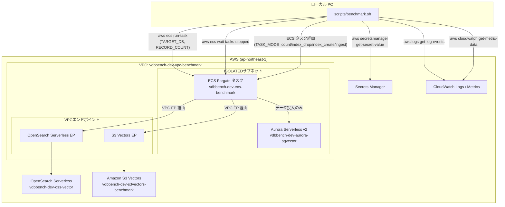
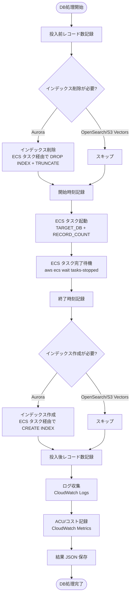

# 技術設計書: ベンチマークシェルスクリプト

## 概要

本設計書は、ローカル PC 上で実行するベンチマークシェルスクリプト（`scripts/benchmark.sh`）の技術設計を定義する。
本スクリプトは Spec 03 で構築した ECS Fargate タスクを活用し、3つのベクトルデータベース（Aurora pgvector、OpenSearch Serverless、Amazon S3 Vectors）に対して、インデックス操作・データ投入・メトリクス収集を一貫して自動実行する。

ACU/OCU は CDK 側で固定値として設定済み（ACU: 最小0/最大10、OCU: 検索・インデックスともに最大10）であり、シェルスクリプトからの変更は行わない。

### 設計方針

- シェルスクリプトはローカル PC 上で実行し、AWS CLI で全 AWS リソースを操作する
- ECS タスクの役割はデータ投入のみに限定し、Aurora のインデックス操作はシェルスクリプトから ECS タスクの `TASK_MODE` 環境変数を使用して制御する
- 既存の ECS タスク（`main.py`）に `TARGET_DB` 環境変数を追加し、単一 DB 指定モードをサポートする
- OpenSearch は既存インデックスに Bulk API で一括投入するのみ（インデックス削除・作成は行わない）
- 1回の実行で Aurora → OpenSearch → S3 Vectors の順に3つの DB 全てのベンチマークサイクルを自動完了する
- ACU/OCU は CDK 側で固定設定済みのため、シェルスクリプトからのスケーリング操作は不要


## アーキテクチャ

### 全体構成



### ベンチマークサイクルフロー

各 DB に対して以下のサイクルを順次実行する:




## コンポーネントとインターフェース

### コンポーネント構成

```text
scripts/
  benchmark.sh              # メインベンチマークスクリプト

ecs/bulk-ingest/
  main.py                   # 修正: TARGET_DB 環境変数対応
  index_manager.py          # 変更なし
  ingestion.py              # 変更なし
  metrics.py                # 変更なし
  vector_generator.py       # 変更なし
```

### 1. ECS タスク main.py の修正

既存の `main.py` に `TARGET_DB` 環境変数を追加する。

| 環境変数 | 値 | 動作 |
| --- | --- | --- |
| `TARGET_DB` | 未設定 / `all` | 既存動作（3DB 順次処理、インデックス操作含む） |
| `TARGET_DB` | `aurora` | Aurora のみデータ投入（インデックス操作なし） |
| `TARGET_DB` | `opensearch` | OpenSearch のみデータ投入（インデックス操作なし） |
| `TARGET_DB` | `s3vectors` | S3 Vectors のみデータ投入（インデックス操作なし） |
| `TARGET_DB` | その他 | エラーログ出力、終了コード 1 |

`TARGET_DB` が単一 DB 指定の場合、インデックス操作をスキップしデータ投入のみ実行する。

```python
# main.py の修正イメージ
def main() -> None:
    target_db = os.environ.get("TARGET_DB", "all").lower()

    valid_targets = {"all", "aurora", "opensearch", "s3vectors"}
    if target_db not in valid_targets:
        logger.error("invalid_target_db", target_db=target_db)
        sys.exit(1)

    # データ投入モード
    if target_db == "all":
        # 既存動作: 3DB 順次処理（インデックス操作含む）
        _run_all_databases(record_count)
    else:
        # 単一 DB: データ投入のみ（インデックス操作なし）
        _run_single_database(target_db, record_count)
```

### 2. シェルスクリプト（scripts/benchmark.sh）

#### 前提条件チェック

スクリプト実行開始時に以下を確認する:

- `aws` CLI コマンドの存在
- `jq` コマンドの存在
- `bc` コマンドの存在
- AWS 認証情報の有効性（`aws sts get-caller-identity`）

#### コマンドライン引数

```bash
scripts/benchmark.sh [OPTIONS]

Options:
  --record-count N              投入レコード数 (デフォルト: 100000)
  --aurora-cluster ID           Aurora クラスター識別子 (デフォルト: vdbbench-dev-aurora-pgvector)
  --opensearch-collection NAME  OpenSearch コレクション名 (デフォルト: vdbbench-dev-oss-vector)
  --s3vectors-bucket NAME       S3 Vectors バケット名 (デフォルト: vdbbench-dev-s3vectors-benchmark)
  --ecs-cluster NAME            ECS クラスター名 (デフォルト: vdbbench-dev-ecs-benchmark)
  --region REGION               AWS リージョン (デフォルト: ap-northeast-1)
  --ecs-log-group NAME          ECS タスクの CloudWatch Logs ロググループ名
  --aurora-secret-arn ARN       Aurora Secrets Manager シークレット ARN
  --task-definition ARN         ECS タスク定義 ARN
  --subnet-ids IDS              Fargate サブネット ID（カンマ区切り）
  --security-group-id ID        Fargate セキュリティグループ ID
  --help                        ヘルプ表示
```

#### 主要関数構成

| 関数名 | 責務 |
| --- | --- |
| `main` | 全体フロー制御、結果ディレクトリ作成、サマリー生成 |
| `check_prerequisites` | 前提条件チェック（aws, jq, bc, 認証情報） |
| `parse_args` | コマンドライン引数パース |
| `run_benchmark_cycle` | 1つの DB に対するベンチマークサイクル全体 |
| `drop_aurora_index` / `create_aurora_index` | Aurora インデックス操作（ECS タスク経由） |
| `run_ecs_task_with_mode` | ECS タスクをモード指定で起動・待機（インデックス操作・レコード数取得用） |
| `run_ecs_task` | ECS データ投入タスク起動・待機 |
| `get_record_count` | 各 DB のレコード数取得（ECS タスク経由） |
| `collect_task_logs` | CloudWatch Logs からログ収集 |
| `collect_aurora_metrics` | Aurora ACU メトリクス取得（時系列データ保存） |
| `collect_opensearch_metrics` | OpenSearch OCU メトリクス取得（時系列データ保存） |
| `calculate_fargate_cost` | Fargate 概算コスト算出 |
| `calculate_aurora_acu_cost` | Aurora ACU 概算コスト算出（時系列積分） |
| `calculate_opensearch_ocu_cost` | OpenSearch OCU 概算コスト算出（時系列積分） |
| `calculate_s3vectors_cost` | S3 Vectors PUT バイトコスト算出 |
| `save_result_json` | 個別 DB 結果 JSON 保存（18 引数） |
| `generate_summary` | 全 DB 統合サマリー生成 |
| `cleanup` | trap 用クリーンアップ |
| `log_info` / `log_error` / `log_separator` | ログ出力ユーティリティ |

#### Aurora インデックス操作（ECS タスク経由）

Aurora はプライベートサブネット内にあるため、ローカル PC から直接 psql 接続できない。
そのため、インデックス操作は ECS タスクの `TASK_MODE` 環境変数を使用して実行する。

```bash
# インデックス削除 + TRUNCATE（ECS タスク経由）
drop_aurora_index() {
    log_info "Aurora インデックス削除を開始します（ECS タスク経由）..."
    run_ecs_task_with_mode "aurora" "index_drop"
}

# インデックス再作成（ECS タスク経由）
create_aurora_index() {
    log_info "Aurora HNSW インデックス作成を開始します（ECS タスク経由）..."
    run_ecs_task_with_mode "aurora" "index_create"
}

# ECS タスクをモード指定で起動し完了を待機する汎用関数
run_ecs_task_with_mode() {
    local target_db="$1"
    local task_mode="$2"

    task_arn=$(aws ecs run-task \
        --cluster "$ECS_CLUSTER" \
        --task-definition "$TASK_DEFINITION" \
        --launch-type FARGATE \
        --network-configuration "..." \
        --overrides '{
            "containerOverrides": [{
                "name": "BulkIngestContainer",
                "environment": [
                    {"name": "TARGET_DB", "value": "'"$target_db"'"},
                    {"name": "TASK_MODE", "value": "'"$task_mode"'"}
                ]
            }]
        }' \
        --query 'tasks[0].taskArn' --output text \
        --region "$REGION")

    aws ecs wait tasks-stopped \
        --cluster "$ECS_CLUSTER" \
        --tasks "$task_arn" \
        --region "$REGION"

    # 終了コード確認
    # ...
}
```

#### ECS タスク起動（データ投入）

```bash
run_ecs_task() {
    local target_db="$1"
    local record_count="$2"

    START_TIME=$(date -u +"%Y-%m-%dT%H:%M:%SZ")

    TASK_ARN=$(aws ecs run-task \
        --cluster "$ECS_CLUSTER" \
        --task-definition "$TASK_DEFINITION" \
        --launch-type FARGATE \
        --network-configuration "..." \
        --overrides '{
            "containerOverrides": [{
                "name": "BulkIngestContainer",
                "environment": [
                    {"name": "TARGET_DB", "value": "'"$target_db"'"},
                    {"name": "TASK_MODE", "value": "ingest"},
                    {"name": "RECORD_COUNT", "value": "'"$record_count"'"}
                ]
            }]
        }' \
        --query 'tasks[0].taskArn' --output text \
        --region "$REGION")

    aws ecs wait tasks-stopped \
        --cluster "$ECS_CLUSTER" \
        --tasks "$TASK_ARN" \
        --region "$REGION"

    END_TIME=$(date -u +"%Y-%m-%dT%H:%M:%SZ")

    # 終了コード確認
    EXIT_CODE=$(aws ecs describe-tasks \
        --cluster "$ECS_CLUSTER" \
        --tasks "$TASK_ARN" \
        --query 'tasks[0].containers[0].exitCode' --output text \
        --region "$REGION")
}
```

#### レコード数取得（ECS タスク経由）

Aurora はプライベートサブネット内にあるため、レコード数取得も ECS タスク経由で行う。
OpenSearch も VPC 制限のため同様。S3 Vectors も統一的に ECS タスク経由で取得する。

```bash
# 指定 DB のレコード数を ECS タスク経由で取得する
# 結果はグローバル変数 ECS_COUNT_RESULT に設定される
get_record_count() {
    local target_db="$1"
    log_info "${target_db} のレコード数を取得中（ECS タスク経由）..."

    if run_ecs_task_with_mode "$target_db" "count"; then
        echo "$ECS_COUNT_RESULT"
    else
        log_error "${target_db} のレコード数取得に失敗しました"
        echo "0"
    fi
}
```

ECS タスクは `TASK_MODE=count` で起動され、CloudWatch Logs に `RECORD_COUNT_RESULT:N` 形式でレコード数を出力する。シェルスクリプトはログからこの値を抽出する。

#### クリーンアップ処理

```bash
cleanup() {
    log_info "クリーンアップ処理を実行中..."
    # ACU/OCU は CDK 側で固定設定済みのため、復元処理は不要
    # 必要に応じて一時ファイルの削除等を行う
    log_info "クリーンアップ完了"
}

trap cleanup EXIT
```


## データモデル

### 個別 DB 結果 JSON（例: aurora-result.json）

```json
{
  "database": "aurora_pgvector",
  "record_count": 100000,
  "pre_count": 0,
  "post_count": 100000,
  "start_time": "2025-01-15T10:00:00Z",
  "end_time": "2025-01-15T10:05:30Z",
  "duration_seconds": 330,
  "throughput_records_per_sec": 303.03,
  "index_drop_success": true,
  "index_create_success": true,
  "ecs_task_arn": "arn:aws:ecs:ap-northeast-1:123456789012:task/vdbbench-dev-ecs-benchmark/abc123",
  "ecs_exit_code": 0,
  "acu_during": 5.0,
  "fargate_cost_usd": 0.02,
  "opensearch_ocu_peak": 0,
  "index_create_duration_seconds": 45,
  "service_cost_usd": 0.35,
  "success": true,
  "error_message": null
}
```

### サマリー JSON（summary.json）

```json
{
  "benchmark_id": "20250115-100000",
  "region": "ap-northeast-1",
  "record_count": 100000,
  "vector_dimension": 1536,
  "results": {
    "aurora_pgvector": {
      "duration_seconds": 330,
      "throughput_records_per_sec": 303.03,
      "pre_count": 0,
      "post_count": 100000,
      "index_create_duration_seconds": 45,
      "service_cost_usd": 0.35,
      "success": true
    },
    "opensearch": {
      "duration_seconds": 450,
      "throughput_records_per_sec": 222.22,
      "pre_count": 0,
      "post_count": 100000,
      "opensearch_ocu_peak": 4.0,
      "service_cost_usd": 0.72,
      "success": true
    },
    "s3vectors": {
      "duration_seconds": 200,
      "throughput_records_per_sec": 500.00,
      "pre_count": 0,
      "post_count": 100000,
      "service_cost_usd": 0.14,
      "success": true
    }
  },
  "cost_summary": {
    "aurora_acu_peak": 5.0,
    "aurora_acu_cost_usd": 0.35,
    "opensearch_ocu_peak": 4.0,
    "opensearch_ocu_cost_usd": 0.72,
    "s3vectors_cost_usd": 0.14,
    "fargate_total_seconds": 980,
    "fargate_vcpu": 2,
    "fargate_memory_gb": 4,
    "fargate_estimated_cost_usd": 0.05
  },
  "total_duration_seconds": 1200,
  "completed_at": "2025-01-15T10:20:00Z"
}
```

### コスト概算ロジック

```bash
# Fargate コスト概算（ap-northeast-1 料金）
# vCPU: $0.05056/時間, メモリ: $0.00553/GB/時間
calculate_fargate_cost() {
    local duration_seconds="$1"
    local vcpu=2
    local memory_gb=4
    local hours
    hours=$(echo "scale=6; $duration_seconds / 3600" | bc)
    local vcpu_cost
    vcpu_cost=$(echo "scale=6; $hours * $vcpu * 0.05056" | bc)
    local memory_cost
    memory_cost=$(echo "scale=6; $hours * $memory_gb * 0.00553" | bc)
    echo "scale=4; $vcpu_cost + $memory_cost" | bc
}

# Aurora ACU コスト概算（ap-northeast-1 料金）
# 時系列データから台形積分で算出する
# ACU 単価: $0.12/ACU/時間
# 入力: 時系列 JSON ファイルパス（collect_aurora_metrics が保存したもの）
# 算出方法: 各データポイント間の ACU 値を台形近似で積分し、
#           合計 ACU·秒 を ACU·時間に変換して単価を乗算する
calculate_aurora_acu_cost() {
    local timeseries_file="$1"
    # jq で timestamps/values 配列から台形積分を計算
    ...
}

# OpenSearch OCU コスト概算（ap-northeast-1 料金）
# 時系列データから台形積分で算出する
# OCU 単価: $0.24/OCU/時間
# Indexing OCU と Search OCU を個別に積分し合算する
calculate_opensearch_ocu_cost() {
    local timeseries_file="$1"
    # jq で indexing_ocu/search_ocu の timestamps/values から台形積分を計算
    ...
}

# S3 Vectors コスト概算（ap-northeast-1 料金）
# Put bytes: $0.219/GB
# 1レコード = 1536次元 × 4バイト(float32) + メタデータ ≈ 6656バイト
calculate_s3vectors_cost() {
    local record_count="$1"
    ...
}
```

### ベンチマーク結果ディレクトリ構造

```text
results/
  YYYYMMDD-HHMMSS/
    aurora-result.json          # Aurora 個別結果
    opensearch-result.json      # OpenSearch 個別結果
    s3vectors-result.json       # S3 Vectors 個別結果
    aurora-task.log             # Aurora ECS タスクログ
    opensearch-task.log         # OpenSearch ECS タスクログ
    s3vectors-task.log          # S3 Vectors ECS タスクログ
    cost-summary.json           # コストサマリー
    summary.json                # 全体サマリー
```

### ECS タスク TARGET_DB 別の動作マトリクス

| TARGET_DB | 実行内容 |
| --- | --- |
| `aurora` | Aurora データ投入のみ |
| `opensearch` | OpenSearch データ投入のみ（Bulk API で既存インデックスに投入） |
| `s3vectors` | S3 Vectors データ投入のみ |
| `all` | 3DB 順次処理（インデックス操作含む、後方互換） |


## 正当性プロパティ

*プロパティとは、システムのすべての有効な実行において真であるべき特性や振る舞いのことである。人間が読める仕様と機械的に検証可能な正当性保証の橋渡しとなる形式的な記述である。*

### プロパティ 1: TARGET_DB ルーティングの正確性

*任意の* 有効な単一 DB ターゲット（`aurora`、`opensearch`、`s3vectors` のいずれか）に対して、`TARGET_DB` にその値が設定された場合、ECS タスクは指定された DB のデータ投入のみを実行し、他の DB の処理およびインデックス操作（drop_index / create_index）は一切実行しないこと。

**検証対象: 要件 1.1, 1.2, 1.3, 1.6**

### プロパティ 2: 無効な TARGET_DB の拒否

*任意の* 文字列で、有効な TARGET_DB 値の集合（`all`、`aurora`、`opensearch`、`s3vectors`）に含まれないものに対して、ECS タスクはエラーログを出力し終了コード 1 で終了すること。

**検証対象: 要件 1.5**

### プロパティ 3: 処理時間算出の正確性

*任意の* 2つの ISO 8601 形式タイムスタンプ（終了時刻 >= 開始時刻）に対して、算出される処理時間（秒）は終了時刻と開始時刻の差分に等しいこと。

**検証対象: 要件 3.6**

### プロパティ 4: Fargate 概算コスト算出の正確性

*任意の* 正の実行時間（秒）に対して、Fargate 概算コストは `(duration_seconds / 3600) * (vcpu * 0.05056 + memory_gb * 0.00553)` に等しいこと（浮動小数点誤差を許容）。

**検証対象: 要件 6.3**

### プロパティ 5: 結果 JSON の必須フィールド完全性

*任意の* ベンチマーク実行結果に対して、個別 DB 結果 JSON は `database`、`record_count`、`pre_count`、`post_count`、`start_time`、`end_time`、`duration_seconds`、`throughput_records_per_sec`、`success` の全フィールドを含み、サマリー JSON は `benchmark_id`、`region`、`record_count`、`results`（3 DB 分）、`cost_summary` の全フィールドを含むこと。

**検証対象: 要件 7.2, 7.4**

### プロパティ 6: コマンドライン引数パースとデフォルト値

*任意の* コマンドライン引数の組み合わせに対して、指定された引数はその値が使用され、未指定の引数はデフォルト値が使用されること。具体的には、`--record-count` 未指定時は 100000、`--aurora-cluster` 未指定時は `vdbbench-dev-aurora-pgvector`、`--region` 未指定時は `ap-northeast-1` 等、全引数のデフォルト値が正しく適用されること。

**検証対象: 要件 8.1, 8.2, 8.3, 8.4, 8.5, 8.6**


## エラーハンドリング

### シェルスクリプトのエラーハンドリング

| エラー種別 | 対処方法 | 動作 |
| --- | --- | --- |
| 前提条件不足（aws/jq/bc 未インストール） | スクリプト開始時にチェック | エラーメッセージ出力、終了コード 1 |
| AWS 認証情報無効 | `aws sts get-caller-identity` で確認 | エラーメッセージ出力、終了コード 1 |
| インデックス操作失敗（ECS タスク経由） | エラーメッセージ出力 | 該当 DB の処理を中断、次の DB へ |
| ECS タスク起動失敗 | エラーメッセージ出力 | 該当 DB の処理を中断、次の DB へ |
| ECS タスク異常終了 | 終了コード・理由をログ記録 | 該当 DB を失敗として記録、次の DB へ |
| CloudWatch Logs 取得失敗 | 警告メッセージ出力 | ログファイルなしで続行 |
| メトリクス取得失敗 | 警告メッセージ出力 | メトリクスなしで続行 |
| スクリプト異常終了（Ctrl+C 等） | trap EXIT でクリーンアップ | クリーンアップ処理を実行して終了 |

### クリーンアップ保証

- `trap cleanup EXIT` により、正常終了・異常終了を問わずクリーンアップ処理を実行する
- ACU/OCU は CDK 側で固定設定済みのため、スケーリング復元処理は不要
- クリーンアップでは一時ファイルの削除等、必要な後処理を行う

### ECS タスクのエラーハンドリング（main.py 修正分）

| エラー種別 | 対処方法 | 動作 |
| --- | --- | --- |
| 無効な TARGET_DB | バリデーション | エラーログ出力、`sys.exit(1)` |
| 単一 DB 投入時の接続失敗 | リトライ（既存ロジック） | 失敗時はエラーログ出力、`sys.exit(1)` |

## テスト戦略

### テストの二重アプローチ

ユニットテストとプロパティベーステストの両方を実施する。

- ユニットテスト: 特定の具体例、エッジケース、エラー条件を検証
- プロパティテスト: すべての入力に対して普遍的に成立するプロパティを検証

### プロパティベーステスト

ライブラリ:

- Python: Hypothesis（ECS タスク main.py のルーティングロジックテスト）
- シェルスクリプト: bats-core + 手動プロパティテスト（引数パース、コスト算出等）

各プロパティテストは最低 100 回のイテレーションを実行する。
各テストには設計書のプロパティ番号をタグ付けする。
タグ形式: `Feature: 04-benchmark-shell-script, Property {番号}: {プロパティ名}`
各正当性プロパティは単一のプロパティベーステストで実装する。

### テスト対象と手法の対応

| テスト対象 | 手法 | ツール |
| --- | --- | --- |
| TARGET_DB ルーティング（単一 DB） | プロパティテスト | Hypothesis |
| 無効な TARGET_DB 拒否 | プロパティテスト | Hypothesis |
| TARGET_DB=all の後方互換性 | ユニットテスト | pytest (mock) |
| 処理時間算出 | プロパティテスト | Hypothesis |
| Fargate コスト算出 | プロパティテスト | Hypothesis |
| 結果 JSON 必須フィールド | プロパティテスト | Hypothesis |
| コマンドライン引数パース | プロパティテスト | bats-core |
| 前提条件チェック | ユニットテスト | bats-core |
| クリーンアップ処理（trap） | ユニットテスト | bats-core |
| DB 処理順序（Aurora → OpenSearch → S3 Vectors） | ユニットテスト | bats-core |
| --help 出力 | ユニットテスト | bats-core |
| エラー時の継続動作 | ユニットテスト | bats-core |

### テストディレクトリ構成

```text
tests/
  ecs/
    bulk_ingest/
      test_main_routing.py       # TARGET_DB ルーティングテスト（プロパティテスト含む）
      test_main_integration.py   # main.py 統合テスト（mock）
  scripts/
    test_benchmark.bats          # シェルスクリプトテスト（bats-core）
    test_cost_calculation.py     # コスト算出プロパティテスト（Hypothesis）
    test_result_json.py          # 結果 JSON プロパティテスト（Hypothesis）
    test_duration_calc.py        # 処理時間算出プロパティテスト（Hypothesis）
```
