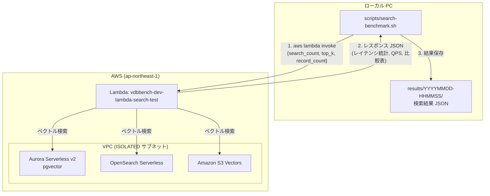
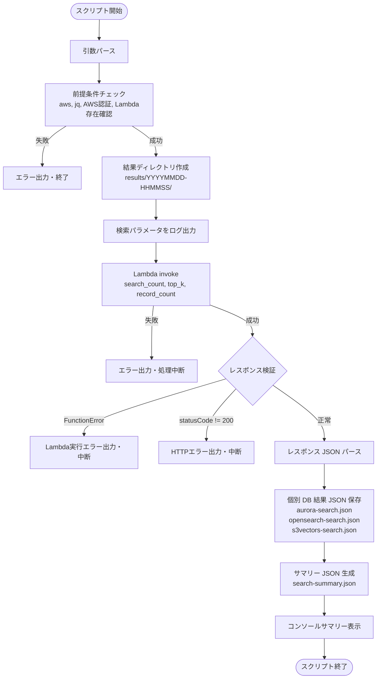

# 技術設計書: 検索ベンチマークシェルスクリプト

## 概要

本設計書は、ローカル PC 上で実行する検索ベンチマークシェルスクリプト（`scripts/search-benchmark.sh`）の技術設計を定義する。
本スクリプトは、デプロイ済みの検索テスト Lambda 関数（`vdbbench-dev-lambda-search-test`）を AWS CLI 経由で invoke し、
3つのベクトルDB（Aurora pgvector、OpenSearch Serverless、Amazon S3 Vectors）に対する検索ベンチマーク結果を取得・保存・表示する。

### 設計方針

- 既存の `scripts/benchmark.sh`（データ投入用）と同様のパターン（ログユーティリティ、引数パース、結果 JSON 生成、コンソールサマリー表示）を踏襲する
- Lambda 関数が3つのDBに対する検索処理とレイテンシ統計算出を一括で行うため、シェルスクリプトは Lambda の invoke と結果の整形・保存に専念する
- Lambda のレスポンス JSON を jq でパースし、個別 DB 結果 JSON とサマリー JSON を生成する
- 検索テスト Lambda のコード変更は行わない（スコープ外）

### 既存 benchmark.sh との差異

| 項目 | benchmark.sh（データ投入） | search-benchmark.sh（検索） |
| --- | --- | --- |
| AWS 操作 | ECS タスク起動・待機 | Lambda invoke |
| 処理時間 | ECS タスク実行時間 | Lambda 実行時間 |
| 結果構造 | 投入レコード数・スループット・コスト | レイテンシ統計・QPS・比較表 |
| 前提条件 | aws, jq, bc | aws, jq（bc 不要） |
| DB 別処理 | 3回の ECS タスク起動 | 1回の Lambda invoke（内部で3DB処理） |


## アーキテクチャ

### 全体構成



### 処理フロー




## コンポーネントとインターフェース

### コンポーネント構成

```text
scripts/
  search-benchmark.sh          # 検索ベンチマークスクリプト（新規作成）

functions/search-test/          # 既存（変更なし）
  handler.py
  logic.py
  models.py
  vector_generator.py
```

### シェルスクリプト関数構成

| 関数名 | 責務 |
| --- | --- |
| `main` | 全体フロー制御（Lambda invoke → 結果保存 → サマリー表示） |
| `parse_args` | コマンドライン引数パース |
| `check_prerequisites` | 前提条件チェック（aws, jq, AWS 認証情報, Lambda 関数存在確認） |
| `invoke_search_lambda` | Lambda を同期 invoke し、レスポンスを検証・返却 |
| `save_db_result_json` | 個別 DB の検索結果を JSON ファイルとして保存 |
| `generate_search_summary` | 全 DB の結果を統合したサマリー JSON を生成 |
| `print_search_summary` | コンソールに検索結果サマリーを表形式で表示 |
| `create_result_dir` | タイムスタンプ付き結果ディレクトリを作成 |
| `cleanup` | trap 用クリーンアップ（一時ファイル削除） |
| `log_info` / `log_error` / `log_separator` | ログ出力ユーティリティ（既存 benchmark.sh と同一パターン） |

### Lambda invoke インターフェース

```bash
# Lambda invoke コマンド
invoke_search_lambda() {
    local payload
    payload=$(jq -n \
        --argjson search_count "$SEARCH_COUNT" \
        --argjson top_k "$TOP_K" \
        --argjson record_count "$RECORD_COUNT" \
        '{search_count: $search_count, top_k: $top_k, record_count: $record_count}')

    local response_file="${RESULT_DIR}/lambda-response.json"

    aws lambda invoke \
        --function-name "$FUNCTION_NAME" \
        --payload "$payload" \
        --cli-binary-format raw-in-base64-out \
        --region "$REGION" \
        "$response_file"

    # FunctionError チェック
    # statusCode チェック
    # body の JSON パース
}
```

### コマンドライン引数

```bash
scripts/search-benchmark.sh [OPTIONS]

Options:
  --search-count N       検索回数 (デフォルト: 100)
  --top-k N              近傍返却件数 (デフォルト: 10)
  --record-count N       投入済みレコード数 (デフォルト: 100000)
  --function-name NAME   Lambda 関数名 (デフォルト: vdbbench-dev-lambda-search-test)
  --region REGION        AWS リージョン (デフォルト: ap-northeast-1)
  --help                 ヘルプ表示
```

### 前提条件チェック

```bash
check_prerequisites() {
    # 1. aws CLI の存在確認
    # 2. jq コマンドの存在確認
    # 3. AWS 認証情報の有効性確認（aws sts get-caller-identity）
    # 4. Lambda 関数の存在確認（aws lambda get-function）
}
```


## データモデル

### Lambda レスポンス構造（入力）

Lambda は以下の構造のレスポンスを返す。シェルスクリプトはこの JSON をパースして結果を抽出する。

```json
{
  "statusCode": 200,
  "body": "{\"aurora\": {...}, \"opensearch\": {...}, \"s3vectors\": {...}, \"search_count\": 100, \"top_k\": 10, \"comparison\": [...]}"
}
```

`body` 内の各 DB オブジェクト構造:

```json
{
  "database": "aurora_pgvector",
  "latency": {
    "avg_ms": 12.5,
    "p50_ms": 11.2,
    "p95_ms": 25.3,
    "p99_ms": 45.1,
    "min_ms": 5.1,
    "max_ms": 52.3
  },
  "throughput_qps": 80.5,
  "search_count": 100,
  "top_k": 10,
  "success": true,
  "error_message": null
}
```

### 個別 DB 検索結果 JSON（出力: aurora-search.json 等）

```json
{
  "database": "aurora_pgvector",
  "latency": {
    "avg_ms": 12.5,
    "p50_ms": 11.2,
    "p95_ms": 25.3,
    "p99_ms": 45.1,
    "min_ms": 5.1,
    "max_ms": 52.3
  },
  "throughput_qps": 80.5,
  "search_count": 100,
  "top_k": 10,
  "success": true,
  "error_message": null
}
```

### サマリー JSON（出力: search-summary.json）

```json
{
  "benchmark_id": "20250115-100000",
  "region": "ap-northeast-1",
  "search_params": {
    "search_count": 100,
    "top_k": 10,
    "record_count": 100000
  },
  "results": {
    "aurora_pgvector": {
      "latency": {
        "avg_ms": 12.5,
        "p50_ms": 11.2,
        "p95_ms": 25.3,
        "p99_ms": 45.1,
        "min_ms": 5.1,
        "max_ms": 52.3
      },
      "throughput_qps": 80.5,
      "success": true
    },
    "opensearch": {
      "latency": {
        "avg_ms": 8.3,
        "p50_ms": 7.1,
        "p95_ms": 18.5,
        "p99_ms": 32.0,
        "min_ms": 3.2,
        "max_ms": 40.1
      },
      "throughput_qps": 120.3,
      "success": true
    },
    "s3vectors": {
      "latency": {
        "avg_ms": 15.7,
        "p50_ms": 14.3,
        "p95_ms": 30.2,
        "p99_ms": 55.8,
        "min_ms": 6.5,
        "max_ms": 60.2
      },
      "throughput_qps": 63.7,
      "success": true
    }
  },
  "comparison": [
    {"metric": "avg_ms", "aurora_pgvector": 12.5, "opensearch": 8.3, "s3vectors": 15.7},
    {"metric": "p50_ms", "aurora_pgvector": 11.2, "opensearch": 7.1, "s3vectors": 14.3},
    {"metric": "p95_ms", "aurora_pgvector": 25.3, "opensearch": 18.5, "s3vectors": 30.2},
    {"metric": "p99_ms", "aurora_pgvector": 45.1, "opensearch": 32.0, "s3vectors": 55.8},
    {"metric": "min_ms", "aurora_pgvector": 5.1, "opensearch": 3.2, "s3vectors": 6.5},
    {"metric": "max_ms", "aurora_pgvector": 52.3, "opensearch": 40.1, "s3vectors": 60.2},
    {"metric": "throughput_qps", "aurora_pgvector": 80.5, "opensearch": 120.3, "s3vectors": 63.7}
  ],
  "total_duration_seconds": 45,
  "completed_at": "2025-01-15T10:01:00Z"
}
```

### ベンチマーク結果ディレクトリ構造

```text
results/
  YYYYMMDD-HHMMSS/
    lambda-response.json        # Lambda 生レスポンス（デバッグ用）
    aurora-search.json           # Aurora 個別検索結果
    opensearch-search.json       # OpenSearch 個別検索結果
    s3vectors-search.json        # S3 Vectors 個別検索結果
    search-summary.json          # 全体サマリー
```

### コンソールサマリー表示フォーマット

```text
========================================
検索ベンチマーク結果サマリー
========================================
検索パラメータ: search_count=100, top_k=10, record_count=100000

DB                  | avg_ms  | p50_ms  | p95_ms  | p99_ms  | QPS     | 成否
--------------------|---------|---------|---------|---------|---------|------
aurora_pgvector     |   12.50 |   11.20 |   25.30 |   45.10 |   80.50 | ✓
opensearch          |    8.30 |    7.10 |   18.50 |   32.00 |  120.30 | ✓
s3vectors           |   15.70 |   14.30 |   30.20 |   55.80 |   63.70 | ✓
========================================
結果保存先: results/20250115-100000/
========================================
```


## 正当性プロパティ

*プロパティとは、システムのすべての有効な実行において真であるべき特性や振る舞いのことである。人間が読める仕様と機械的に検証可能な正当性保証の橋渡しとなる形式的な記述である。*

### プロパティ 1: コマンドライン引数パースとデフォルト値

*任意の* コマンドライン引数の組み合わせに対して、指定された引数はその値が使用され、未指定の引数はデフォルト値が使用されること。具体的には、`--search-count` 未指定時は 100、`--top-k` 未指定時は 10、`--record-count` 未指定時は 100000、`--function-name` 未指定時は `vdbbench-dev-lambda-search-test`、`--region` 未指定時は `ap-northeast-1` が適用されること。

**検証対象: 要件 4.1, 4.2, 4.3, 4.4, 4.5**

### プロパティ 2: 個別 DB 検索結果 JSON の必須フィールド完全性

*任意の* 有効な Lambda レスポンス（3つの DB の検索結果を含む）に対して、`save_db_result_json` 関数が生成する個別 DB 結果 JSON は `database`、`latency`（`avg_ms`、`p50_ms`、`p95_ms`、`p99_ms`、`min_ms`、`max_ms` を含む）、`throughput_qps`、`search_count`、`top_k`、`success` の全フィールドを含むこと。また、3つの DB（aurora、opensearch、s3vectors）それぞれに対応するファイルが生成されること。

**検証対象: 要件 1.3, 2.2, 2.3**

### プロパティ 3: サマリー JSON の必須フィールド完全性

*任意の* 有効な検索パラメータと Lambda レスポンスに対して、`generate_search_summary` 関数が生成するサマリー JSON は `benchmark_id`、`region`、`search_params`（`search_count`、`top_k`、`record_count` を含む）、`results`（3 DB 分）、`comparison`、`total_duration_seconds`、`completed_at` の全フィールドを含むこと。

**検証対象: 要件 2.4, 2.5**

### プロパティ 4: コンソールサマリー出力の完全性

*任意の* 有効な Lambda レスポンスに対して、`print_search_summary` 関数のコンソール出力は、各 DB（aurora_pgvector、opensearch、s3vectors）のレイテンシ統計値（avg_ms、p50_ms、p95_ms、p99_ms）、スループット（QPS）、および成否情報を全て含むこと。

**検証対象: 要件 3.1, 3.2, 3.3**


## エラーハンドリング

### エラー種別と対処方法

| エラー種別 | 対処方法 | 動作 |
| --- | --- | --- |
| 前提条件不足（aws/jq 未インストール） | スクリプト開始時にチェック | エラーメッセージ出力、終了コード 1 |
| AWS 認証情報無効 | `aws sts get-caller-identity` で確認 | エラーメッセージ出力、終了コード 1 |
| Lambda 関数が存在しない | `aws lambda get-function` で確認 | 関数名を含むエラーメッセージ出力、終了コード 1 |
| Lambda invoke 失敗（CLI エラー） | aws lambda invoke の戻り値チェック | エラーメッセージ出力、処理中断 |
| Lambda FunctionError | レスポンスの FunctionError フィールドチェック | エラー詳細をログ出力、処理中断 |
| Lambda statusCode != 200 | レスポンス body の statusCode チェック | エラーメッセージ出力、処理中断 |
| レスポンス JSON パースエラー | jq パース結果チェック | エラーメッセージ出力、処理中断 |
| スクリプト異常終了（Ctrl+C 等） | `trap cleanup EXIT` | 一時ファイル削除して終了 |

### エラーハンドリングの方針

- `set -euo pipefail` により、未定義変数の使用やパイプラインエラーを即座に検出する
- 前提条件チェックは全て invoke 前に実施し、早期に失敗させる
- Lambda invoke 後のエラーチェックは段階的に行う:
  1. aws CLI コマンド自体の成否
  2. FunctionError の有無
  3. statusCode の値
  4. body の JSON パース可否
- エラー発生時は原因特定に必要な情報（関数名、ステータスコード、エラーメッセージ等）をログに含める


## テスト戦略

### テストの二重アプローチ

ユニットテストとプロパティベーステストの両方を実施する。

- ユニットテスト: 特定の具体例、エッジケース、エラー条件を検証
- プロパティテスト: すべての入力に対して普遍的に成立するプロパティを検証

### プロパティベーステスト

ライブラリ:

- シェルスクリプト引数パース: bats-core（プロパティテスト的に複数パターンを網羅）
- JSON スキーマ検証: Hypothesis（Python）

各プロパティテストは最低 100 回のイテレーションを実行する。
各テストには設計書のプロパティ番号をタグ付けする。
タグ形式: `Feature: 07-search-benchmark-script, Property {番号}: {プロパティ名}`
各正当性プロパティは単一のプロパティベーステストで実装する。

### テスト対象と手法の対応

| テスト対象 | 手法 | ツール | プロパティ |
| --- | --- | --- | --- |
| コマンドライン引数パース・デフォルト値 | プロパティテスト | bats-core | プロパティ 1 |
| 個別 DB 結果 JSON 必須フィールド | プロパティテスト | Hypothesis | プロパティ 2 |
| サマリー JSON 必須フィールド | プロパティテスト | Hypothesis | プロパティ 3 |
| コンソールサマリー出力完全性 | プロパティテスト | Hypothesis | プロパティ 4 |
| 前提条件チェック（aws/jq 不在時） | ユニットテスト | bats-core | - |
| --help 出力 | ユニットテスト | bats-core | - |
| Lambda invoke エラーハンドリング | ユニットテスト | bats-core | - |
| FunctionError ハンドリング | ユニットテスト | bats-core | - |

### テストディレクトリ構成

```text
tests/
  scripts/
    test_search_benchmark.bats          # 引数パース・前提条件チェック（bats-core）
    test_search_result_json.py          # 検索結果 JSON プロパティテスト（Hypothesis）
```

### Hypothesis テストの実装方針

既存の `tests/scripts/test_result_json.py` と同様のパターンを踏襲する:

- `search-benchmark.sh` から `save_db_result_json`、`generate_search_summary`、`print_search_summary` 関数を抽出して bash スクリプトとして実行
- Hypothesis でランダムなレイテンシ値・スループット値・検索パラメータを生成
- 生成された JSON の必須フィールド存在を検証
- コンソール出力に必要な値が含まれることを検証

### bats テストの実装方針

既存の `tests/scripts/test_benchmark.bats` と同様のパターンを踏襲する:

- `search-benchmark.sh` からエントリポイント以前の部分を抽出して eval
- `parse_args` 関数を直接呼び出してデフォルト値・オーバーライドを検証
- 前提条件チェックのエラーケースを検証

