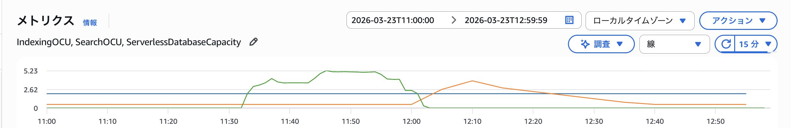
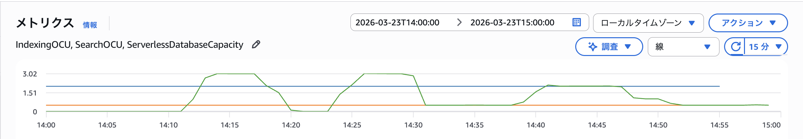

# vector-db-benchmark

AWS のベクトルデータベースサービス（Aurora pgvector、OpenSearch Serverless、S3 Vectors）を
実際に構築・動作確認し、知見を蓄積するための技術検証リポジトリ。

## アーキテクチャ

- VPC + プライベートサブネット
- Aurora Serverless v2（pgvector 拡張）
- OpenSearch Serverless（ベクトル検索コレクション）
- Amazon S3 Vectors
- Lambda（Python 3.13）による動作確認関数

## 前提条件

- Node.js 24.x
- Python 3.13
- AWS CLI v2（SSO 設定済み）
- AWS CDK v2（`npm install` で導入）
- AWS SAM CLI
- Docker（`sam build --use-container` で使用）

ランタイムバージョンは `.tool-versions`（asdf）で管理。

## セットアップ

```bash
# Node.js 依存のインストール
npm install

# Python 仮想環境のセットアップ
python -m venv .venv
source .venv/bin/activate
pip install -e ".[dev]"
```

## AWS 認証

AWS SSO を使用。デプロイ前にログインしてください。

```bash
aws login
```

## デプロイ

### デプロイコマンド

```bash
# 1. Lambda 関数のビルド（Docker コンテナ内で依存ライブラリをビルド）
sam build --use-container

# 2. CDK デプロイ（デフォルトプロファイル）
npx cdk deploy VectorDbBenchmarkStack

# プロファイルを指定する場合
npx cdk deploy VectorDbBenchmarkStack --profile <profile-name>
```

### 差分確認

```bash
npx cdk diff VectorDbBenchmarkStack
```

### 削除

```bash
npx cdk destroy VectorDbBenchmarkStack
```

## 動作確認

デプロイ後、Lambda 関数を実行してベクトルデータベースの動作を確認できます。

```bash
aws lambda invoke \
  --function-name vdbbench-dev-lambda-vector-verify \
  --region ap-northeast-1 \
  /tmp/response.json

cat /tmp/response.json | python -m json.tool
```

Aurora pgvector、OpenSearch Serverless、S3 Vectors それぞれに対して
ダミーベクトルの投入・検索を実行し、結果を JSON で返します。

## テスト

```bash
# CDK テスト（TypeScript）
npm test

# Python テスト
pytest
```

## コード品質

```bash
# TypeScript
npm run lint
npm run format

# Python
ruff check .
ruff format .
mypy .
```

## ECS 一括投入タスクの技術詳細

ECS Fargate タスクから VPC 内の各ベクトル DB にデータを投入する仕組みの技術メモ。
後から読み返す際のポイントとしてまとめる。

### ネットワーク構成

#### VPC・サブネット

NAT Gateway なしの ISOLATED サブネットのみで構成。外部通信はすべて VPC エンドポイント経由。

```typescript
// lib/constructs/network.ts
this.vpc = new ec2.Vpc(this, "Vpc", {
  vpcName: "vdbbench-dev-vpc-benchmark",
  ipAddresses: ec2.IpAddresses.cidr("10.0.0.0/16"),
  maxAzs: 2,
  natGateways: 0,
  subnetConfiguration: [
    {
      cidrMask: 24,
      name: "vdbbench-dev-subnet-isolated",
      subnetType: ec2.SubnetType.PRIVATE_ISOLATED,
    },
  ],
});
```

#### VPC エンドポイント

ECS タスクが各サービスにアクセスするために必要な VPC エンドポイント一覧:

| エンドポイント | 種別 | 用途 |
|---|---|---|
| Secrets Manager | Interface | Aurora 接続情報の取得 |
| CloudWatch Logs | Interface | ECS タスクログの送信 |
| S3 Vectors | Interface | S3 Vectors API アクセス |
| ECR API | Interface | コンテナイメージのメタデータ取得 |
| ECR Docker | Interface | コンテナイメージレイヤーの pull |
| S3 | Gateway | ECR イメージレイヤーの取得（S3 経由） |
| OpenSearch Serverless | `CfnVpcEndpoint` | OpenSearch Serverless コレクションへのアクセス |

```typescript
// lib/constructs/network.ts - Interface Endpoints
this.vpc.addInterfaceEndpoint("SecretsManagerEndpoint", {
  service: ec2.InterfaceVpcEndpointAwsService.SECRETS_MANAGER,
  subnets: { subnetType: ec2.SubnetType.PRIVATE_ISOLATED },
  securityGroups: [this.vpcEndpointSg],
});
this.vpc.addInterfaceEndpoint("S3VectorsEndpoint", {
  service: ec2.InterfaceVpcEndpointAwsService.S3_VECTORS,
  subnets: { subnetType: ec2.SubnetType.PRIVATE_ISOLATED },
  securityGroups: [this.vpcEndpointSg],
});

// S3 Gateway Endpoint（ECR イメージレイヤー用）
this.vpc.addGatewayEndpoint("S3GatewayEndpoint", {
  service: ec2.GatewayVpcEndpointAwsService.S3,
  subnets: [{ subnetType: ec2.SubnetType.PRIVATE_ISOLATED }],
});
```

OpenSearch Serverless は通常の VPC エンドポイントではなく、`CfnVpcEndpoint` で専用のエンドポイントを作成する:

```typescript
// lib/constructs/opensearch.ts
const vpcEndpoint = new opensearchserverless.CfnVpcEndpoint(this, "VpcEndpoint", {
  name: `${collectionName}-vpce`,
  vpcId: props.vpc.vpcId,
  subnetIds: props.vpc.selectSubnets({
    subnetType: ec2.SubnetType.PRIVATE_ISOLATED,
  }).subnetIds,
  securityGroupIds: [props.vpcEndpointSg.securityGroupId],
});
```

#### セキュリティグループ

4 つの SG を使い分ける: Lambda 用、Aurora 用、VPC エンドポイント用、ECS 用。

```text
ECS (ecsSg) --:5432--> Aurora (auroraSg)
ECS (ecsSg) --:443---> VPC Endpoints (vpcEndpointSg)
```

```typescript
// lib/constructs/network.ts
// ECS -> Aurora:5432
this.ecsSg.addEgressRule(this.auroraSg, ec2.Port.tcp(5432), "Allow ECS to Aurora");
this.auroraSg.addIngressRule(this.ecsSg, ec2.Port.tcp(5432), "Allow inbound from ECS");

// ECS -> VPC Endpoints:443（Secrets Manager, CloudWatch Logs, S3 Vectors, ECR, OpenSearch）
this.ecsSg.addEgressRule(this.vpcEndpointSg, ec2.Port.tcp(443), "Allow ECS to VPC endpoints");
this.vpcEndpointSg.addIngressRule(this.ecsSg, ec2.Port.tcp(443), "Allow inbound from ECS");

// ECS -> S3 Gateway Endpoint（ルートテーブルベースだが HTTPS 通信の許可が必要）
this.ecsSg.addEgressRule(ec2.Peer.anyIpv4(), ec2.Port.tcp(443), "Allow ECS to S3 via Gateway Endpoint");
```

#### DNS 設定

- Interface VPC エンドポイントはプライベート DNS を自動有効化（CDK デフォルト）
- OpenSearch Serverless の `CfnVpcEndpoint` はネットワークポリシーで `SourceVPCEs` に指定し、コレクションへのアクセスを VPC 内に限定

```typescript
// lib/constructs/opensearch.ts - ネットワークポリシー
policy: JSON.stringify([{
  Rules: [
    { Resource: [`collection/${collectionName}`], ResourceType: "collection" },
    { Resource: [`collection/${collectionName}`], ResourceType: "dashboard" },
  ],
  AllowFromPublic: false,
  SourceVPCEs: [vpcEndpoint.attrId],  // VPC エンドポイント経由のみ許可
}]),
```

### タスクモード

ECS タスクは環境変数 `TARGET_DB` と `TASK_MODE` で動作を切り替える。

| TASK_MODE | 動作 |
|---|---|
| `ingest` | データ投入（デフォルト） |
| `index_drop` | インデックス削除 / TRUNCATE |
| `index_create` | インデックス作成 |
| `count` | レコード件数取得 |

### Aurora pgvector

Aurora は唯一、明示的なインデックス操作（HNSW インデックスの削除・作成）と TRUNCATE を行う DB。
認証は Secrets Manager 経由の ID/PW。

#### 接続

```python
# ecs/bulk-ingest/main.py - _get_aurora_connection()
secret = json.loads(
    secrets_client.get_secret_value(SecretId=secret_arn)["SecretString"]
)
conn = psycopg2.connect(
    host=secret["host"], port=secret["port"],
    dbname=secret["dbname"],
    user=secret["username"], password=secret["password"],
)
```

#### テーブル自動作成（冪等）

```python
# ecs/bulk-ingest/index_manager.py - AuroraIndexManager.ensure_table()
with self._connection.cursor() as cur:
    cur.execute("CREATE EXTENSION IF NOT EXISTS vector;")
    cur.execute(
        f"CREATE TABLE IF NOT EXISTS {INDEX_NAME} "
        f"(content TEXT, embedding vector({VECTOR_DIMENSION}));"
    )
self._connection.commit()
```

#### インデックス削除 + TRUNCATE

```python
# ecs/bulk-ingest/index_manager.py - AuroraIndexManager.drop_index()
with self._connection.cursor() as cur:
    cur.execute(f"DROP INDEX IF EXISTS {HNSW_INDEX_NAME};")
    cur.execute(
        f"SELECT EXISTS (SELECT 1 FROM information_schema.tables "
        f"WHERE table_name = '{INDEX_NAME}');"
    )
    table_exists = cur.fetchone()[0]
    if table_exists:
        cur.execute(f"TRUNCATE TABLE {INDEX_NAME};")
self._connection.commit()
```

#### HNSW インデックス作成

```python
# ecs/bulk-ingest/index_manager.py - AuroraIndexManager.create_index()
with self._connection.cursor() as cur:
    cur.execute(
        f"CREATE INDEX {HNSW_INDEX_NAME} "
        f"ON {INDEX_NAME} USING hnsw (embedding vector_cosine_ops) "
        "WITH (m = 16, ef_construction = 64);"
    )
self._connection.commit()
```

#### データ投入（バッチ INSERT）

```python
# ecs/bulk-ingest/ingestion.py - AuroraIngester.ingest_batch()
sql = (
    f"INSERT INTO embeddings (content, embedding) "
    f"VALUES {', '.join(values_parts)};"
)
with self._connection.cursor() as cur:
    cur.execute(sql, params)
self._connection.commit()
```

#### レコード件数取得

```python
# ecs/bulk-ingest/main.py - _run_count_operation()
with conn.cursor() as cur:
    cur.execute("SELECT COUNT(*) FROM embeddings;")
    result = cur.fetchone()
    count = result[0] if result else 0
```

### OpenSearch Serverless

OpenSearch Serverless はインデックスの削除・再作成による性能メリットがないため、`drop_index` / `create_index` は no-op。
初回アクセス時に `ensure_index()` で knn_vector マッピング付きインデックスを自動作成する。
認証は SigV4（IAM ロール）。

#### 接続（SigV4 認証）

```python
# ecs/bulk-ingest/main.py - _get_opensearch_client()
awsauth = AWS4Auth(
    frozen.access_key, frozen.secret_key, region, "aoss",
    session_token=frozen.token,
)
client = OpenSearch(
    hosts=[{"host": host, "port": 443}],
    http_auth=awsauth,
    use_ssl=True,
    verify_certs=True,
    connection_class=RequestsHttpConnection,
)
```

#### インデックス自動作成（冪等）

```python
# ecs/bulk-ingest/index_manager.py - OpenSearchIndexManager.ensure_index()
body = {
    "settings": {"index": {"knn": True}},
    "mappings": {
        "properties": {
            "embedding": {
                "type": "knn_vector",
                "dimension": VECTOR_DIMENSION,
                "method": {
                    "name": "hnsw",
                    "space_type": "cosinesimil",
                    "engine": "nmslib",
                },
            },
        },
    },
}
self._client.indices.create(index=INDEX_NAME, body=body)
```

#### データ投入（Bulk API）

```python
# ecs/bulk-ingest/ingestion.py - OpenSearchIngester.ingest_batch()
bulk_body: list[dict[str, object]] = []
for i in range(start_index, end_index):
    # VECTOR コレクションでは _id 指定不可
    bulk_body.append({"index": {"_index": "embeddings"}})
    bulk_body.append({
        "id": i,
        "content": f"doc-{i}",
        "embedding": generate_vector(seed=i),
    })
response = self._client.bulk(body=bulk_body)
```

> **注意**: OpenSearch Serverless の VECTOR コレクションでは
> Bulk API の `_id` フィールドを指定すると
> `illegal_argument_exception: Document ID is not supported`
> エラーになる。

#### レコード件数取得

```python
# ecs/bulk-ingest/main.py - _run_count_operation()
resp = os_client.count(index="embeddings")
count = resp.get("count", 0)
```

### Amazon S3 Vectors

S3 Vectors はフルマネージドでユーザーが制御可能なインデックスがないため、`drop_index` / `create_index` は no-op。
バケットとインデックスは CDK で事前作成済み。
認証は IAM ロール（boto3 デフォルト）。

#### 接続

```python
# ecs/bulk-ingest/main.py - _get_s3vectors_client()
s3v_client = boto3.client("s3vectors", region_name=region)
```

#### データ投入（PutVectors API）

```python
# ecs/bulk-ingest/ingestion.py - S3VectorsIngester.ingest_batch()
vectors = []
for i in range(start_index, end_index):
    vectors.append({
        "key": str(i),
        "data": {"float32": generate_vector(seed=i)},
        "metadata": {"content": f"doc-{i}"},
    })
self._client.put_vectors(
    vectorBucketName=self._bucket_name,
    indexName=self._index_name,
    vectors=vectors,
)
```

#### レコード件数取得

```python
# ecs/bulk-ingest/main.py - _run_count_operation()
resp = s3v_client.list_vectors(
    vectorBucketName=bucket_name, indexName=index_name,
)
count = len(resp.get("vectors", []))
```

## ベンチマーク結果

### 条件

| 項目 | 値 |
|---|---|
| リージョン | ap-northeast-1 |
| ベクトル次元数 | 1536 |
| 投入レコード数 | 100,000 |
| 検索クエリ数 | 100 |
| top_k | 10 |
| Aurora Min ACU | 0.5 |
| Aurora Max ACU | 10 |
| OpenSearch Max IndexingOCU | 10 |
| OpenSearch Max SearchOCU | 10 |
| OpenSearch Standby Replicas | DISABLED |

### データ投入（ECS Fargate 経由）

| DB | 投入時間 | インデックス作成時間 | 合計時間 | 備考 |
|---|---|---|---|---|
| Aurora pgvector | 560秒（約9.3分） | 714秒（約11.9分） | 約21.2分 | HNSW インデックス作成含む |
| OpenSearch Serverless | 527秒（約8.8分） | - | 約8.8分 | インデックス自動管理 |
| S3 Vectors | 559秒（約9.3分） | - | 約9.3分 | インデックス自動管理 |

単純処理時間でいうとOpenSearchが一番早く、Auroraが一番長いという結果になりました。
Auroraはデータ投入とインデックス作成の2段階にしていますが、これを同時にやるともっと長いかもしれません。

OpenSearchとS3 Vectorsについては、データ投入が終わってもインデックス作成は非同期処理のようで、投入件数とプログラムから認識できる件数が一致するまで十数分の遅延がありました。
実運用においても注意が必要と思います。

#### ACU・OCUの推移（CloudWatch、5分間隔 Maximum）



イメージ通り、データ投入中なACU/OCUともに上昇しています。
OCUはデータ投入時においてはインデックスOCUのみ上昇するようです。

### 検索ベンチマーク（Lambda 経由、100クエリ）

AuroraのACUはコールドスタートを回避するため、ベンチマーク実行前に最小ACUを0.5に変更しています。

| DB | 平均値 (ms) | 中央値 (ms) | P95 (ms) | P99 (ms) | スループット (queries/sec) |
|---|---|---|---|---|---|
| Aurora pgvector | 13.3 | 12.5 | 18.7 | 24.1 | 75.0 |
| OpenSearch Serverless | 86.8 | 82.4 | 120.3 | 145.2 | 11.5 |
| S3 Vectors | 76.3 | 72.1 | 105.8 | 128.4 | 13.1 |

今回検証したデータ量においてはAuroraが一番速いという結果になりました。
データ量がもっと増えればOpenSearchが有利になると思われますが、この件数ではOpenSearch Serverlessはその構成の複雑さによるオーバーヘッドにより他に劣ってしまうのだと考えます。
小中規模のベクトルデータベースにおいてはAuroraが最適だろうと考えます。

#### ACU・OCUの推移（CloudWatch、5分間隔 Maximum）



今回の範疇においてはAuroraは検索に伴いACUが上昇していますが、OCUは動きは見られませんでした。

## ディレクトリ構成

```shell
├── bin/                    # CDK アプリケーションエントリポイント
├── lib/
│   ├── constructs/         # CDK Construct（Aurora, OpenSearch, S3 Vectors 等）
│   └── vector-db-benchmark-stack.ts
├── functions/
│   └── vector-verify/      # 動作確認 Lambda 関数（Python）
├── test/                   # CDK テスト（TypeScript / Jest）
├── tests/                  # Python テスト（pytest）
└── docs/                   # ドキュメント・ダイアグラム
```
